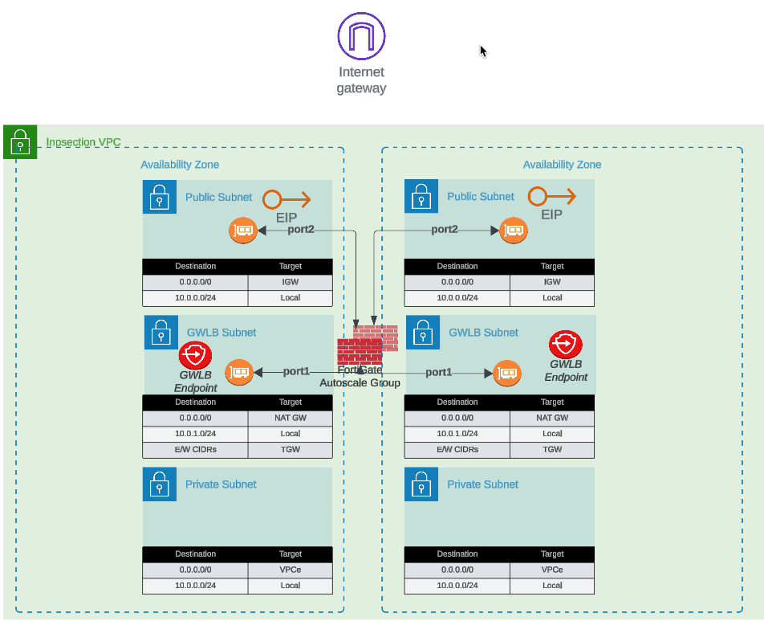
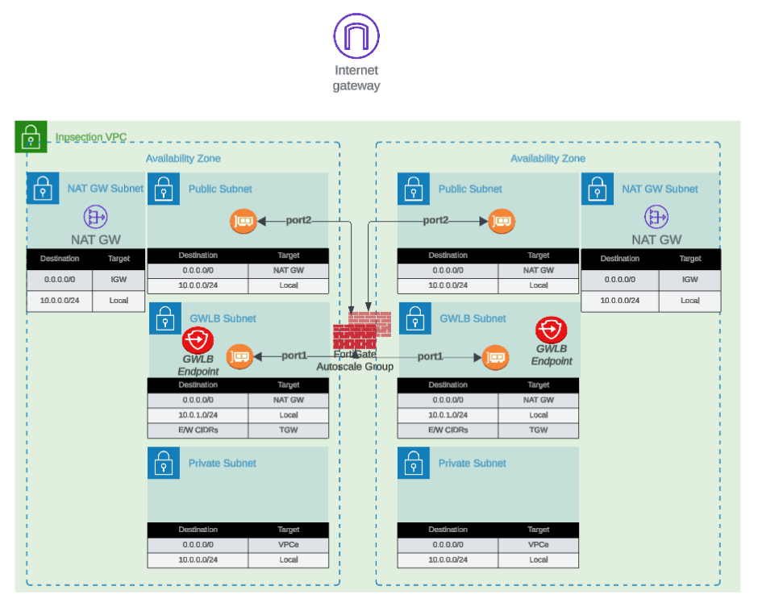
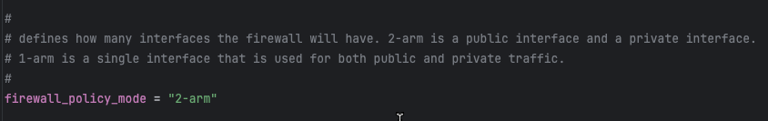
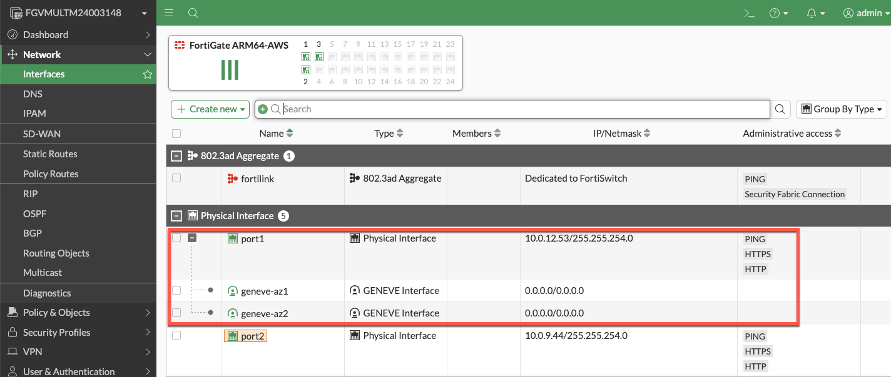

#### Egress Options

The FortiGate Autoscale solution provides two options for egress traffic. The first option is to use an Elastic IP (EIP). Each instance in the autoscale group will have an associated EIP and NAT all traffic with a public internet destination behind the public IP associated with the EIP. This option is configured in the template terraform.tfvars file by setting the following variable to eip:

access_internet_mode = "eip"

This architecture routes all internet traffic to port2 and the default route for port2 in the public subnet is the IGW. The traffic is NAT'd to the associated EIP as it passes through the IGW. The EIP's used in the autoscale group are pulled from a pool owned by AWS and you will be unable to predict the value assigned. This can be a problem if you are NATing to a destination that wants to whitelist the source IP. On the other hand, using EIP's to NAT will avoid the cost of using NAT Gateways. 

The second option is to use a NAT Gateway to NAT all traffic to the internet. This option is configured by setting the access_internet_mode = "nat_gw". This architecture will use a Public IP that does not change for the life of the NAT Gateway. This makes whitelisting at the destination easier to implement. The NAT Gateway requires an extra subnet and route table to send the traffic to the NAT Gateway, prior to egressing through the IGW. 

#### 2-ARM vs 1-ARM

A Fortigate can be deployed in a 2-ARM or 1-ARM configuration. This is controlled by setting the firewall_policy_mode variable in the terraform.tfvars to "1-arm" or "2-arm". 

The 2-ARM configuration is the most common and is used when you want to have a "trusted/private" port and an "untrusted/public" port. All traffic coming into the Fortigate will ingress through the GWLB Endpoints. The traffic this then forwarded to the Gateway Load Balancer and this allows load-balancing between all members of the autoscale group. Connectivity between the Gateway Load Balancer and Fortigate instances is via Geneve Tunnel encapsulation. The tunnels are terminated on Fortigate port1. The Fortigate in 2-arm mode, will forward traffic destined to the public internet to port2 and NAT out the EIP or NAT Gateway. In 1-arm mode, the Fortigate will only have one port for the Fortigate data plane. That means, ingress traffic will arrive on port1, but encapsulated in Geneve. If the destination is the public internet, the Fortigate will remove the Geneve encapsulation and hairpin the traffic back to port1 and egress to the internet. The tunnels using Geneve encapsulation are logical interfaces to the Fortigate, so we are not violating any split-horizon rules by sending the traffic back to the same physical port it was originally received on. This can be illustrated on the Network interfaces screen on the Fortigate GUI. 

The important thing to remember here is; traffic received on a geneve tunnel and sent out to the public internet will allow responses to be sent back. The GWLB is a stateful load balancer and will allow response traffic to be sent back to through the geneve tunnel to the original source. But traffic that is sourced from the geneve tunnel side and sent to the GWLB, will be dropped. The traffic must originate from the GWLBe side to get an entry in the state table.

