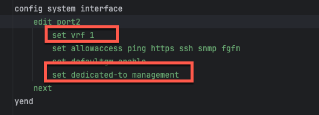
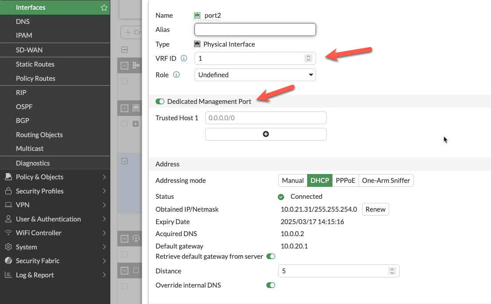
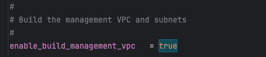
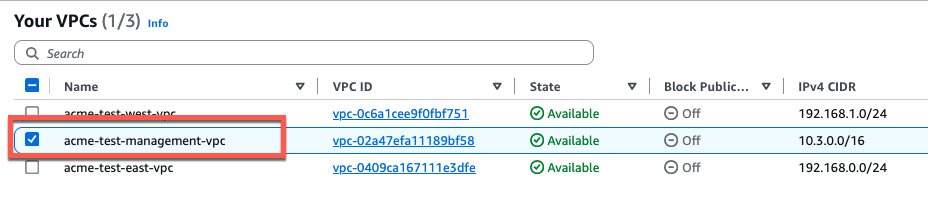
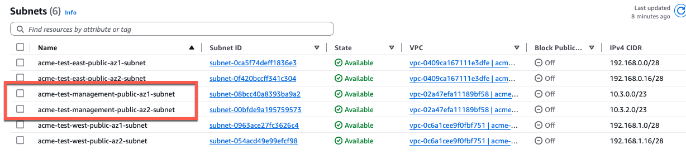
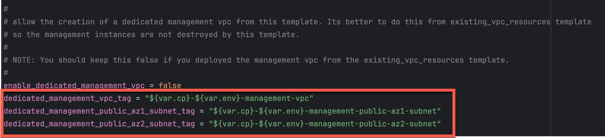

## Overview

The FortiGate autoscale solution provides multiple approaches to isolating management traffic from data plane traffic, ranging from shared interfaces to complete physical network separation.

This page covers three progressive levels of management isolation, allowing you to choose the appropriate security posture for your deployment requirements.

---

## Option 1: Combined Data + Management (Default)

### Architecture Overview

In the default configuration, port2 serves dual purposes:
- **Data plane**: Internet egress for inspected traffic (in 2-ARM mode)
- **Management plane**: GUI, SSH, SNMP access

### Configuration
```hcl
enable_dedicated_management_eni = false
enable_dedicated_management_vpc = false
```

### Characteristics
- **Simplest configuration**: No additional interfaces or VPCs required
- **Lower cost**: Minimal infrastructure overhead
- **Shared security groups**: Same rules govern data and management traffic
- **Single failure domain**: Management access tied to data plane availability

### When to Use
- Development and testing environments
- Proof-of-concept deployments
- Budget-constrained projects
- Simple architectures without compliance requirements

---

## Option 2: Dedicated Management ENI

### Architecture Overview

Port2 is removed from the data plane and dedicated exclusively to management functions. FortiOS configures the interface with `set dedicated-to management`, placing it in an isolated VRF with independent routing.



### Configuration
```hcl
enable_dedicated_management_eni = true
```

### How It Works

1. **Dedicated-to attribute**: FortiOS configures port2 with `set dedicated-to management`
2. **Separate VRF**: Port2 is placed in an isolated VRF with independent routing table
3. **Policy restrictions**: FortiGate prevents creation of firewall policies using port2
4. **Management-only traffic**: GUI, SSH, SNMP, and FortiManager/FortiAnalyzer connectivity

### FortiOS Configuration Impact

The dedicated management ENI can be verified in the FortiGate GUI:



The interface shows the `dedicated-to: management` attribute and separate VRF assignment, preventing data plane traffic from using this interface.

### Important Compatibility Notes

{}
**No Public IP on the Dedicated Management Port: What Still Works, What Doesn't**

When combining:
- `firewall_policy_mode = "2-arm"`
- `access_internet_mode = "nat_gw"`
- `enable_dedicated_management_eni = true`
- `enable_fgt_management_public_ip = false`

Port2 receives **no** Elastic IP address. This is the intended, low-exposure pattern for customers who reach the FortiGate over AWS Direct Connect or a VPN and don't want a public IP on the management interface at all:

- ❌ **Cannot** access FortiGate management from the public internet — a NAT Gateway is outbound-only, so this is unavoidable without a public IP; use Direct Connect, VPN, or the management VPC (Option 3) for admin access instead.
- ✅ **Can** still reach FortiGuard and validate licensing — see below.
- ✅ **Can** access via private IP through AWS Direct Connect or VPN
- ✅ **Can** access via management VPC (see Option 3 below)

If you require public internet access to the FortiGate management interface with NAT Gateway egress, either:
1. Use `access_internet_mode = "eip"` (assigns EIP to port2)
2. Use dedicated management VPC with separate internet connectivity (Option 3)
3. Implement AWS Systems Manager Session Manager for private connectivity
{}

### Public IP on the Dedicated Management Port

`enable_fgt_management_public_ip` (default `true`) controls whether the dedicated management port itself is assigned a public IP at all. If you reach management exclusively through Direct Connect, VPN, or a peered/TGW-attached network, set this to `false` — a public IP on a management interface is unneeded exposure once a private path exists.

```hcl
enable_dedicated_management_eni = true
enable_fgt_management_public_ip = false
```

### Egress Without a Public IP: Routing to the NAT Gateway

Direct Connect customers still need *outbound* internet access from the management interface for FortiGuard updates and license validation, even with no public IP and no inbound exposure. Without a routing path, that egress silently fails — no FortiGuard signature updates, no license/entitlement checks.

`enable_dedicated_management_public_ip` in `existing_vpc_resources/terraform.tfvars` controls this at the network layer, and **must be kept in sync** with `enable_fgt_management_public_ip` in `autoscale_template/terraform.tfvars`:

```hcl
# existing_vpc_resources/terraform.tfvars
create_management_subnet_in_inspection_vpc = true
enable_dedicated_management_public_ip      = false   # matches enable_fgt_management_public_ip below
create_nat_gateway_subnets                 = true    # required -- see access_internet_mode below

# autoscale_template/terraform.tfvars
access_internet_mode             = "nat_gw"
enable_dedicated_management_eni  = true
enable_fgt_management_public_ip  = false
```

With `enable_dedicated_management_public_ip = false`, the dedicated management subnets' default route points at the inspection VPC's existing per-AZ NAT Gateway instead of the Internet Gateway — the same NAT Gateway already used for data-plane egress in `nat_gw` mode, not a separate one. When `true` (the default), the route stays on the IGW as before, which only provides real connectivity once the interface actually has a public IP (an IGW route with no public IP on the instance is not a usable egress path — AWS's Internet Gateway does 1:1 NAT to a real public IP, not many-to-one).

If `access_internet_mode` isn't `"nat_gw"` (i.e. no NAT Gateway exists in the inspection VPC to route to), this setting has no NAT Gateway to fall back on and the route stays on the IGW regardless — egress from the dedicated management port with no public IP is only possible in `nat_gw` mode.

### Characteristics
- **Clear separation of concerns**: Management traffic isolated from data plane
- **Independent security policies**: Separate security groups for management interface
- **Enhanced security posture**: Reduces attack surface on management plane
- **Moderate complexity**: Requires additional subnet and routing configuration

### When to Use
- Production deployments requiring management isolation
- Security-conscious environments
- Architectures without dedicated management VPC
- Compliance requirements for management plane separation

---

## Option 3: Dedicated Management VPC (Full Isolation)

### Architecture Overview

The dedicated management VPC provides complete physical network separation by deploying FortiGate management interfaces in an entirely separate VPC from the data plane.



### Configuration
```hcl
enable_dedicated_management_vpc = true
dedicated_management_vpc_tag = "your-mgmt-vpc-tag"
dedicated_management_public_az1_subnet_tag = "your-az1-subnet-tag"
dedicated_management_public_az2_subnet_tag = "your-az2-subnet-tag"
```

### Benefits
- **Physical network separation**: Management traffic never traverses inspection VPC
- **Independent internet connectivity**: Management VPC has dedicated IGW or VPN
- **Centralized management infrastructure**: FortiManager and FortiAnalyzer deployed in management VPC
- **Separate security controls**: Management VPC security groups independent of data plane
- **Isolated failure domains**: Management VPC issues don't affect data plane

### Management VPC Creation Options

#### Option A: Created by existing_vpc_resources Template (Recommended)

The `existing_vpc_resources` template creates the management VPC with standardized tags that the simplified template automatically discovers.

**Advantages**:
- Management VPC lifecycle independent of inspection VPC
- FortiManager/FortiAnalyzer persistence across inspection VPC redeployments
- Separation of concerns for infrastructure management

**Default Tags** (automatically created):




**Configuration** (terraform.tfvars):
```hcl
enable_dedicated_management_vpc = true
dedicated_management_vpc_tag = "acme-test-management-vpc"
dedicated_management_public_az1_subnet_tag = "acme-test-management-public-az1-subnet"
dedicated_management_public_az2_subnet_tag = "acme-test-management-public-az2-subnet"
```

#### Option B: Use Existing Management VPC

If you have an existing management VPC with custom tags, configure the template to discover it:



**Configuration**:
```hcl
enable_dedicated_management_vpc = true
dedicated_management_vpc_tag = "my-custom-mgmt-vpc-tag"
dedicated_management_public_az1_subnet_tag = "my-custom-mgmt-public-az1-tag"
dedicated_management_public_az2_subnet_tag = "my-custom-mgmt-public-az2-tag"
```

The template uses these tags to locate the management VPC and subnets via Terraform data sources.

### Behavior When Enabled

When `enable_dedicated_management_vpc = true`:

1. **Automatic ENI creation**: Template creates dedicated management ENI (port2) in management VPC subnets
2. **Implies dedicated management ENI**: Automatically sets `enable_dedicated_management_eni = true`
3. **VPC peering/TGW**: Management VPC must have connectivity to inspection VPC for HA sync
4. **Security group creation**: Appropriate security groups created for management traffic

### Network Connectivity Requirements

**Management VPC → Inspection VPC Connectivity**:
- Required for FortiGate HA synchronization between instances
- Typically implemented via VPC peering or Transit Gateway attachment
- Must allow TCP port 443 (HA sync), TCP 22 (SSH), ICMP (health checks)

**Management VPC → Internet Connectivity**:
- Required for FortiGuard services (signature updates, licensing)
- Required for administrator access to FortiGate management interfaces
- Can be via Internet Gateway, NAT Gateway, or AWS Direct Connect

### Egress Without Public IPs: Dedicated NAT Gateway

The same Direct Connect scenario applies here: FortiManager, FortiAnalyzer, the jump box, and the FortiGate's own dedicated management interface all need outbound internet access for FortiGuard updates and license validation, but a customer reaching the management VPC entirely over Direct Connect doesn't want any of them carrying a public IP.

`enable_dedicated_management_nat_gateway` in `existing_vpc_resources/terraform.tfvars` (default `false`) egresses the entire management VPC through a single dedicated NAT Gateway instead of per-interface Elastic IPs:

```hcl
# existing_vpc_resources/terraform.tfvars
enable_build_management_vpc             = true
enable_dedicated_management_nat_gateway = true
enable_fortimanager_public_ip           = true   # ignored -- forced false, see below
enable_fortianalyzer_public_ip          = true   # ignored -- forced false, see below
enable_jump_box_public_ip               = true   # ignored -- forced false, see below

# autoscale_template/terraform.tfvars
enable_dedicated_management_vpc         = true
enable_dedicated_management_nat_gateway = true   # must match the value above
enable_fgt_management_public_ip         = true   # ignored -- forced false, see below
```

When enabled:

- A single NAT Gateway is provisioned in the same AZ as FortiManager, FortiAnalyzer, and the jump box (they're all AZ1-only by design), avoiding cross-AZ data-transfer charges for their traffic.
- The management VPC's public subnets' default route points at that NAT Gateway instead of the Internet Gateway — every public subnet in the VPC shares one route table, so this is all-or-nothing across AZs, never a mix of IGW and NAT Gateway.
- `enable_fortimanager_public_ip`, `enable_fortianalyzer_public_ip`, and `enable_jump_box_public_ip` are all forced off regardless of their own settings — an EIP alongside NAT'd routing on the same interface doesn't make sense.
- `enable_fgt_management_public_ip` in `autoscale_template` is forced off the same way, so the FortiGate's own dedicated management interface stays consistent with the rest of the management plane.

{}
FortiGate management interfaces in AZ2/AZ3 (multi-AZ deployments) cross an AZ boundary to reach the single AZ1 NAT Gateway. This is an accepted tradeoff given the egress path here carries small, infrequent traffic (FortiGuard checkins, license verification), not routine data-plane volume.
{}

### Characteristics
- **Highest security posture**: Complete physical isolation
- **Greatest flexibility**: Independent infrastructure lifecycle
- **Higher complexity**: Requires VPC peering or TGW configuration
- **Additional cost**: Separate VPC infrastructure and data transfer charges

### When to Use
- Enterprise production deployments
- Strict compliance requirements (PCI-DSS, HIPAA, etc.)
- Multi-account AWS architectures
- Environments with dedicated management infrastructure
- Organizations with existing management VPCs for network security appliances

---

## Comparison Matrix

| Factor | Combined (Default) | Dedicated ENI | Dedicated VPC |
|--------|-------------------|---------------|---------------|
| **Security Isolation** | Low | Medium | High |
| **Complexity** | Lowest | Medium | Highest |
| **Cost** | Lowest | Low | Medium |
| **Management Access** | Via data plane interface | Via dedicated interface | Via separate VPC |
| **Failure Domain Isolation** | No | Partial | Complete |
| **VPC Peering Required** | No | No | Yes |
| **Compliance Suitability** | Basic | Good | Excellent |
| **Best For** | Dev/test, simple deployments | Production, security-conscious | Enterprise, compliance-driven |

---

## Decision Tree

Use this decision tree to select the appropriate management isolation level:

```
1. Is this a production deployment?
   ├─ No → Combined Data + Management (simplest)
   └─ Yes → Continue to question 2

2. Do you have compliance requirements for management plane isolation?
   ├─ No → Dedicated Management ENI (good balance)
   └─ Yes → Continue to question 3

3. Do you have existing management VPC infrastructure?
   ├─ Yes → Dedicated Management VPC (leverage existing)
   └─ No → Evaluate cost/benefit:
       ├─ High security requirements → Dedicated Management VPC
       └─ Moderate requirements → Dedicated Management ENI
```

---

## Deployment Patterns

### Pattern 1: Dedicated ENI + EIP Mode
```hcl
firewall_policy_mode = "2-arm"
access_internet_mode = "eip"
enable_dedicated_management_eni = true
```
- Port2 receives EIP for public management access
- Suitable for environments without management VPC
- Simplified deployment with direct internet management access

### Pattern 2: Dedicated ENI + Management VPC
```hcl
firewall_policy_mode = "2-arm"
access_internet_mode = "nat_gw"
enable_dedicated_management_vpc = true
dedicated_management_vpc_tag = "my-mgmt-vpc"
```
- Port2 connects to separate management VPC
- Management VPC has dedicated internet gateway or VPN connectivity
- Preferred for production environments with strict network segmentation

### Pattern 3: Combined Management (Default)
```hcl
firewall_policy_mode = "2-arm"
access_internet_mode = "eip"
enable_dedicated_management_eni = false
```
- Port2 remains in data plane
- Management access shares public interface with egress traffic
- Simplest configuration but lacks management plane isolation

### Pattern 4: No Public IPs Anywhere (Direct Connect)
```hcl
# existing_vpc_resources/terraform.tfvars
create_management_subnet_in_inspection_vpc = true
enable_dedicated_management_public_ip      = false
create_nat_gateway_subnets                 = true
# -- or, using the dedicated management VPC instead:
enable_build_management_vpc             = true
enable_dedicated_management_nat_gateway = true

# autoscale_template/terraform.tfvars
access_internet_mode             = "nat_gw"
enable_dedicated_management_eni  = true    # or enable_dedicated_management_vpc = true
enable_fgt_management_public_ip  = false
enable_dedicated_management_nat_gateway = true   # only if using the dedicated management VPC
```
- No Elastic IP anywhere in the management path — FortiGate management port, FortiManager, FortiAnalyzer, and the jump box all stay private
- FortiGuard updates and license validation still work, routed through a NAT Gateway rather than an IGW+EIP
- Admin access to the GUI/SSH is only possible via Direct Connect, VPN, TGW-attached network, or SSM Session Manager — there is no public inbound path by design
- The primary pattern for customers whose only connectivity is AWS Direct Connect and who don't want any management-plane interface exposed with a public IP

---

## Best Practices

1. **Enable dedicated management ENI for production**: Provides clear separation of concerns
2. **Use dedicated management VPC for enterprise deployments**: Optimal security posture
3. **Document connectivity requirements**: Ensure operations teams understand access paths
4. **Test connectivity before production**: Verify alternative access methods work
5. **Plan for failure scenarios**: Ensure backup access methods (SSM, VPN) are available
6. **Use existing_vpc_resources template for management VPC**: Separates lifecycle management
7. **Document tag conventions**: Ensure consistent tagging across environments
8. **Monitor management interface health**: Set up CloudWatch alarms for management connectivity

---

## Troubleshooting

### Issue: Cannot access FortiGate management interface

**Check**:
1. Security groups allow inbound traffic on management port (443, 22)
2. Route tables provide path from your location to management interface
3. If using dedicated management VPC, verify VPC peering or TGW is operational
4. If using NAT Gateway mode, verify you have alternative access method (VPN, Direct Connect)

### Issue: Management interface has no public IP

**Cause**: Using `access_internet_mode = "nat_gw"` with dedicated management ENI and `enable_fgt_management_public_ip = false`. This is expected and intentional for Direct Connect/VPN-only deployments — it does not by itself mean FortiGuard/licensing is broken (see next issue).

**If you need public internet access to the GUI/SSH**, choose one:
1. Switch to `access_internet_mode = "eip"` to receive public IP on port2
2. Enable `enable_dedicated_management_vpc = true` with separate internet connectivity
3. Use AWS Systems Manager Session Manager for private access
4. Configure VPN or Direct Connect for private network access

### Issue: FortiGuard updates or license validation failing with no public IP on the management interface

**Cause**: `enable_dedicated_management_public_ip` (in `existing_vpc_resources`) is out of sync with `enable_fgt_management_public_ip` (in `autoscale_template`), or is left at its default `true` while `enable_fgt_management_public_ip` is `false`. In that mismatched state the dedicated management subnet's default route still points at the Internet Gateway, which provides no real egress once the interface has no public IP — FortiGuard and license checks fail silently rather than erroring visibly.

**Check**:
1. `access_internet_mode = "nat_gw"` and `create_nat_gateway_subnets = true` in `existing_vpc_resources/terraform.tfvars` — a NAT Gateway must actually exist to route to.
2. `enable_dedicated_management_public_ip = false` in `existing_vpc_resources/terraform.tfvars` matches `enable_fgt_management_public_ip = false` in `autoscale_template/terraform.tfvars`.
3. Re-apply `existing_vpc_resources` after changing this — it changes route table entries, not just the FortiGate instance.

Same underlying fix applies to the dedicated management VPC path (Option 3) via `enable_dedicated_management_nat_gateway` — see that section above.

### Issue: HA sync not working with dedicated management VPC

**Check**:
1. VPC peering or TGW attachment is configured between management and inspection VPCs
2. Security groups allow TCP 443 between FortiGate instances
3. Route tables in both VPCs have routes to each other's subnets
4. Network ACLs permit required traffic

---

## Next Steps

After configuring management isolation, proceed to [Licensing Options](../4_4_licensing_options/) to choose between BYOL, FortiFlex, or PAYG.
