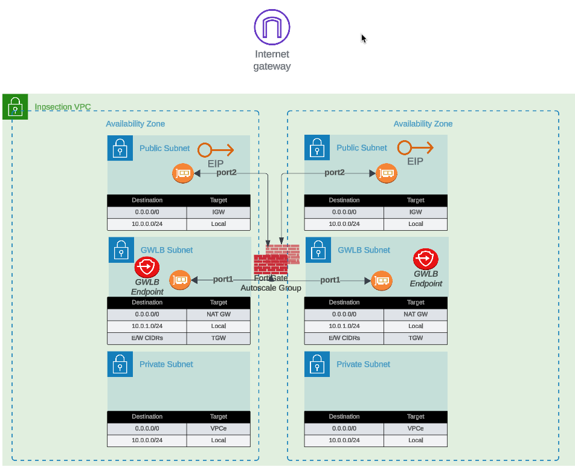
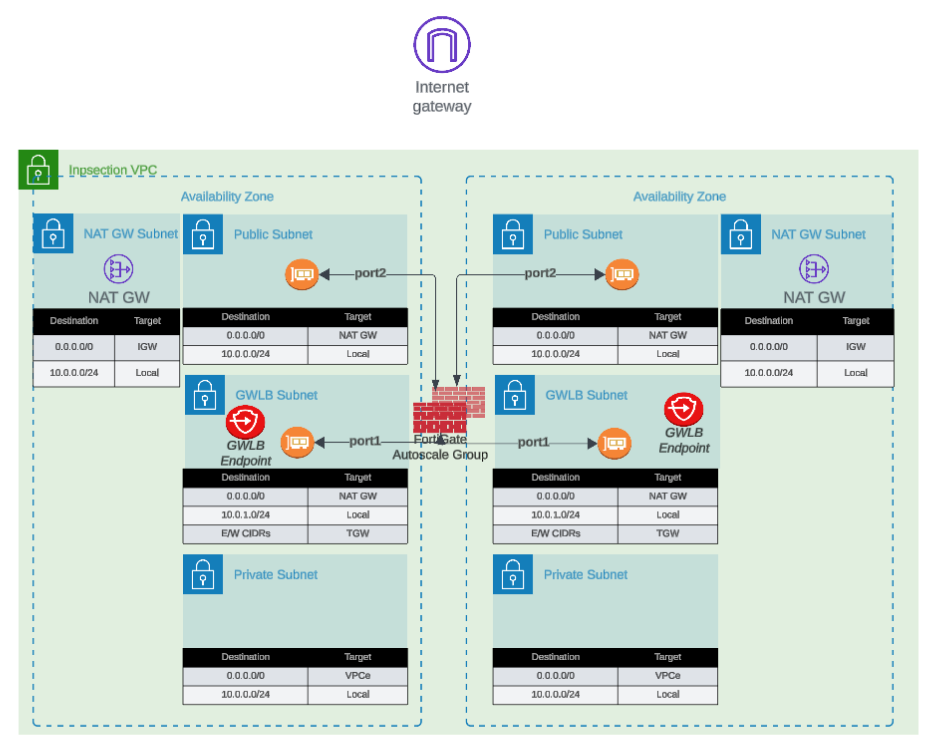
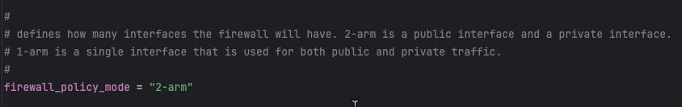

## Overview

The FortiGate Autoscale Simplified Template abstracts complex architectural patterns into configurable components that can be enabled or customized through the `terraform.tfvars` file. This section provides detailed explanations of each component, configuration options, and architectural considerations to help you design the optimal deployment for your requirements.

---

## Internet Egress Options

The FortiGate autoscale solution provides two distinct architectures for internet egress traffic, each optimized for different operational requirements and cost considerations.

### Option 1: Elastic IP (EIP) per Instance

Each FortiGate instance in the autoscale group receives a dedicated Elastic IP address. All traffic destined for the public internet is source-NATed behind the instance's assigned EIP.

#### Configuration
```hcl
access_internet_mode = "eip"
```

#### Architecture Behavior

In EIP mode, the architecture routes all internet-bound traffic to port2 (the public interface). The route table for the public subnet directs traffic to the Internet Gateway (IGW), where automatic source NAT to the associated EIP occurs.



#### Advantages
- **No NAT Gateway costs**: Eliminates monthly NAT Gateway charges ($0.045/hour + data processing)
- **Distributed egress**: Each instance has independent internet connectivity
- **Simplified troubleshooting**: Per-instance source IP simplifies traffic flow analysis
- **No single point of failure**: Loss of one instance's EIP doesn't affect others

#### Considerations
- **Unpredictable IP addresses**: EIPs are allocated from AWS's pool; you cannot predict or specify the assigned addresses
- **Allowlist complexity**: Destinations requiring IP allowlisting must accommodate a pool of EIPs (one per maximum autoscale capacity)
- **IP churn during scaling**: Scale-out events introduce new source IPs; scale-in events remove them
- **Limited EIP quota**: AWS accounts have default limits (5 EIPs per region, increased upon request)

#### Best Use Cases
- Cost-sensitive deployments where NAT Gateway charges exceed EIP allocation costs
- Environments where destination allowlisting is not required
- Architectures prioritizing distributed egress over consistent source IPs
- Development and testing environments with limited budget

### Option 2: NAT Gateway

All FortiGate instances share one or more NAT Gateways deployed in public subnets. Traffic is source-NATed to the NAT Gateway's static Elastic IP address.

#### Configuration
```hcl
access_internet_mode = "nat_gw"
```

#### Architecture Behavior

NAT Gateway mode requires additional subnet and route table configuration. Internet-bound traffic is first routed to the NAT Gateway in the public subnet, which performs source NAT to its static EIP before forwarding to the IGW.



#### Advantages
- **Predictable source IP**: Single, stable public IP address for the lifetime of the NAT Gateway
- **Simplified allowlisting**: Destinations only need to allowlist one IP address (per Availability Zone)
- **High throughput**: NAT Gateway supports up to 45 Gbps per AZ
- **Managed service**: AWS handles NAT Gateway scaling and availability
- **Independent of FortiGate scaling**: Source IP remains constant during scale-in/scale-out events

#### Considerations
- **Additional costs**: $0.045/hour per NAT Gateway + $0.045 per GB data processed
- **Per-AZ deployment**: Multi-AZ architectures require NAT Gateway in each AZ for fault tolerance
- **Additional subnet requirements**: Requires dedicated NAT Gateway subnet in each AZ
- **Route table complexity**: Additional route tables needed for NAT Gateway routing

#### Cost Analysis Example

**Scenario**: 4 FortiGate instances processing 10 TB/month egress traffic

**EIP Mode**:
- 4 EIP allocations: $0 (first EIP free, then $0.00/hour per EIP)
- Total monthly: ~$0 (minimal costs)

**NAT Gateway Mode** (2 AZs):
- 2 NAT Gateways: 2 × $0.045/hour × 730 hours = $65.70
- Data processing: 10,000 GB × $0.045 = $450.00
- Total monthly: $515.70

**Decision Point**: NAT Gateway makes sense when consistent source IP requirement justifies the additional cost.

#### Best Use Cases
- Production environments requiring predictable source IPs
- Compliance scenarios where destination IP allowlisting is mandatory
- High-volume egress traffic to SaaS providers with IP allowlisting requirements
- Architectures where operational simplicity outweighs additional cost

---

## Firewall Architecture: 1-ARM vs 2-ARM

FortiGate instances can operate in single-arm (1-ARM) or dual-arm (2-ARM) network configurations, fundamentally changing traffic flow patterns through the firewall.

### Configuration
```hcl
firewall_policy_mode = "1-arm"  # or "2-arm"
```



### 2-ARM Configuration (Recommended for Most Deployments)

#### Architecture Overview

The 2-ARM configuration deploys FortiGate instances with distinct "trusted" (private) and "untrusted" (public) interfaces, providing clear network segmentation.

**Traffic Flow**:
1. Traffic arrives at GWLB Endpoints (GWLBe) in the inspection VPC
2. GWLB load-balances traffic across healthy FortiGate instances
3. Traffic encapsulated in Geneve tunnels arrives at FortiGate **port1** (data plane)
4. FortiGate inspects traffic and applies security policies
5. Internet-bound traffic exits via **port2** (public interface)
6. Port2 traffic is source-NATed via EIP or NAT Gateway
7. Return traffic follows reverse path back through Geneve tunnels

#### Interface Assignments
- **port1**: Data plane interface for GWLB connectivity (Geneve tunnel termination)
- **port2**: Public interface for internet egress (with optional dedicated management when enabled)

#### Network Interfaces Visualization


The FortiGate GUI displays both physical interfaces and logical Geneve tunnel interfaces. Traffic inspection occurs on the logical tunnel interfaces, while physical port2 handles egress.

#### Advantages
- **Clear network segmentation**: Separate trusted and untrusted zones
- **Traditional firewall model**: Familiar architecture for network security teams
- **Simplified policy creation**: North-South policies align with interface direction
- **Better traffic visibility**: Distinct ingress/egress paths ease troubleshooting
- **Dedicated management option**: Port2 can be isolated for management traffic

#### Best Use Cases
- Production deployments requiring clear network segmentation
- Environments with security policies mandating separate trusted/untrusted zones
- Architectures where dedicated management interface is required
- Standard north-south inspection use cases

### 1-ARM Configuration

#### Architecture Overview

The 1-ARM configuration uses a single interface (port1) for all data plane traffic, eliminating the need for a second network interface.

**Traffic Flow**:
1. Traffic arrives at port1 encapsulated in Geneve tunnels from GWLB
2. FortiGate inspects traffic and applies security policies
3. Traffic is **hairpinned** back through the **same Geneve tunnel** it arrived on
4. Traffic returns to originating distributed VPC through GWLB
5. Distributed VPC uses its own internet egress path (IGW/NAT Gateway)

This "bump-in-the-wire" architecture is the typical 1-ARM pattern for distributed inspection, where the FortiGate provides security inspection but traffic egresses from the spoke VPC, not the inspection VPC.

#### Important Behavior: Stateful Load Balancing

**GWLB Statefulness**: The Gateway Load Balancer maintains connection state tables for traffic flows.

**Primary Traffic Pattern (Distributed Architecture)**:
- ✅ Traffic enters via Geneve tunnel → FortiGate inspection → **Hairpins back through same Geneve tunnel**
- ✅ Distributed VPC handles actual internet egress via its own IGW/NAT Gateway
- ✅ This "bump-in-the-wire" model provides security inspection without routing traffic through inspection VPC

**Key Requirement**: Symmetric routing through the GWLB. Traffic must return via the same Geneve tunnel it arrived on to maintain proper state table entries.

{}
**Centralized Egress Architecture (Transit Gateway Pattern)**

In **centralized egress deployments with Transit Gateway**, the traffic flow is fundamentally different and represents the primary use case for internet egress through the inspection VPC:

**Traffic Flow**:
1. Spoke VPC traffic routes to Transit Gateway
2. TGW routes traffic to inspection VPC
3. Traffic enters GWLBe (same AZ to avoid cross-AZ charges)
4. GWLB forwards traffic through Geneve tunnel to FortiGate
5. FortiGate inspects traffic and applies security policies
6. **Traffic exits port1 (1-ARM) or port2 (2-ARM) toward internet**
7. Egress via EIP or NAT Gateway in inspection VPC
8. Response traffic returns via same interface to same Geneve tunnel

This is the standard architecture for centralized internet egress where:
- All spoke VPCs route internet-bound traffic through the inspection VPC
- FortiGate autoscale group provides centralized security inspection AND NAT
- Single egress point simplifies security policy management and reduces costs
- Requires careful route table configuration to maintain symmetric routing

**When to use**: Centralized egress architectures where spoke VPCs do NOT have their own internet gateways.
{}

{}
**Distributed Architecture - Alternative Pattern (Advanced Use Case)**

In distributed architectures where spoke VPCs have their own internet egress, it is **possible** (but not typical) to configure traffic to exit through the inspection VPC instead of hairpinning:
- Traffic enters via Geneve tunnel → Exits port1 to internet → Response returns via port1 to same Geneve tunnel

This pattern requires:
- Careful route table configuration in the inspection VPC
- Specific firewall policies on the FortiGate
- Proper symmetric routing to maintain GWLB state tables

This is rarely used in distributed architectures since spoke VPCs typically handle their own egress. The standard bump-in-the-wire pattern (hairpin through same Geneve tunnel) is recommended when spoke VPCs have internet gateways.
{}

#### Interface Assignments
- **port1**: Combined data plane (Geneve) and egress (internet) interface

#### Advantages
- **Reduced complexity**: Single interface simplifies routing and subnet allocation
- **Lower costs**: Fewer ENIs to manage and potential for smaller instance types
- **Simplified subnet design**: Only requires one data subnet per AZ

#### Considerations
- **Hairpinning pattern**: Traffic typically hairpins back through same Geneve tunnel
- **Higher port1 bandwidth requirements**: All traffic flows through single interface (both directions)
- **Limited management options**: Cannot enable dedicated management ENI in true 1-ARM mode
- **Route table coordination**: Distributed VPCs maintain their own internet egress paths

#### Interface Assignments
- **port1**: Combined data plane (Geneve) and egress (internet) interface

#### Advantages
- **Reduced complexity**: Single interface simplifies routing and subnet allocation
- **Lower costs**: Fewer ENIs to manage and potential for smaller instance types
- **Simplified subnet design**: Only requires one data subnet per AZ

#### Considerations
- **Hairpinning complexity**: Same physical interface used for ingress and egress
- **Higher port1 bandwidth requirements**: All traffic flows through single interface
- **Limited management options**: Cannot enable dedicated management ENI in true 1-ARM mode
- **Symmetric routing requirement**: All traffic must egress and return via port1 for proper state table maintenance

#### Best Use Cases
- Cost-optimized deployments with lower throughput requirements
- Simple north-south inspection without management VPC integration
- Development and testing environments
- Architectures where simplified subnet design is prioritized

---

## Dedicated Management ENI

The FortiGate autoscale solution supports isolation of management traffic from data plane traffic through a dedicated management ENI configuration.

### Configuration
```hcl
enable_dedicated_management_eni = true
```

### Architecture Overview

When enabled, port2 is removed from the data plane and dedicated exclusively to management functions:

1. **Dedicated-to attribute**: FortiOS configures port2 with `set dedicated-to management`
2. **Separate VRF**: Port2 is placed in an isolated VRF with independent routing table
3. **Policy restrictions**: FortiGate prevents creation of firewall policies using port2
4. **Management-only traffic**: GUI, SSH, SNMP, and FortiManager/FortiAnalyzer connectivity


### FortiOS Configuration Impact

The dedicated management ENI can be verified in the FortiGate GUI:


The interface shows the `dedicated-to: management` attribute and separate VRF assignment, preventing data plane traffic from using this interface.

### Important Compatibility Notes

{}
**Critical Limitation: 2-ARM + NAT Gateway + Dedicated Management ENI**

When combining:
- `firewall_policy_mode = "2-arm"`
- `access_internet_mode = "nat_gw"`
- `enable_dedicated_management_eni = true`

Port2 will **NOT** receive an Elastic IP address. This is a valid configuration, but imposes connectivity restrictions:

- ❌ **Cannot** access FortiGate management from public internet
- ✅ **Can** access via private IP through AWS Direct Connect or VPN
- ✅ **Can** access via management VPC if `enable_dedicated_management_vpc = true`

If you require public internet access to the FortiGate management interface with NAT Gateway egress, either:
1. Use `access_internet_mode = "eip"` (assigns EIP to port2)
2. Use dedicated management VPC with separate internet connectivity
3. Implement AWS Systems Manager Session Manager for private connectivity
{}

### Deployment Patterns

#### Pattern 1: Dedicated Management ENI + EIP Mode
- Port2 receives EIP for public management access
- Suitable for environments without management VPC
- Simplified deployment with direct internet management access

#### Pattern 2: Dedicated Management ENI + Management VPC
- Port2 connects to separate management VPC
- Management VPC has dedicated internet gateway or VPN connectivity
- Preferred for production environments with strict network segmentation

#### Pattern 3: Data Plane + Management Combined (Default)
- Port2 remains in data plane (no dedicated management ENI)
- Management access shares public interface with egress traffic
- Simplest configuration but lacks management plane isolation

### Best Practices

1. **Enable dedicated management ENI for production**: Provides clear separation of concerns
2. **Combine with management VPC when possible**: Optimal security posture
3. **Document connectivity requirements**: Ensure operations teams understand access paths
4. **Test connectivity before disabling combined management**: Verify alternative access methods work
5. **Monitor management interface health**: Dedicated ENI failure isolates management access

---

## Dedicated Management VPC

For organizations requiring complete isolation of management plane from data plane traffic, the template supports deployment of FortiGate management interfaces in a separate VPC.

### Configuration
```hcl
enable_dedicated_management_vpc = true
```


### Architecture Overview

The dedicated management VPC provides:
- **Physical network separation**: Management traffic never traverses inspection VPC
- **Independent internet connectivity**: Management VPC has dedicated IGW or VPN
- **Centralized management infrastructure**: FortiManager and FortiAnalyzer deployed in management VPC
- **Separate security controls**: Management VPC security groups independent of data plane

### Management VPC Creation Options

#### Option 1: Created by existing_vpc_resources Template (Recommended)

The `existing_vpc_resources` template creates the management VPC with standardized tags that the simplified template automatically discovers.

**Advantages**:
- Management VPC lifecycle independent of inspection VPC
- FortiManager/FortiAnalyzer persistence across inspection VPC redeployments
- Separation of concerns for infrastructure management

**Default Tags** (automatically created):


**Configuration** (terraform.tfvars):
```hcl
enable_dedicated_management_vpc = true
dedicated_management_vpc_tag = "acme-test-management-vpc"
dedicated_management_public_az1_subnet_tag = "acme-test-management-public-az1-subnet"
dedicated_management_public_az2_subnet_tag = "acme-test-management-public-az2-subnet"
```

#### Option 2: Use Existing Management VPC

If you have an existing management VPC with custom tags, configure the template to discover it:


**Configuration**:
```hcl
enable_dedicated_management_vpc = true
dedicated_management_vpc_tag = "my-custom-mgmt-vpc-tag"
dedicated_management_public_az1_subnet_tag = "my-custom-mgmt-public-az1-tag"
dedicated_management_public_az2_subnet_tag = "my-custom-mgmt-public-az2-tag"
```

The template uses these tags to locate the management VPC and subnets via Terraform data sources.

### Behavior When Enabled

When `enable_dedicated_management_vpc = true`:

1. **Automatic ENI creation**: Template creates dedicated management ENI (port2) in management VPC subnets
2. **Implies dedicated management ENI**: Automatically sets `enable_dedicated_management_eni = true`
3. **VPC peering/TGW**: Management VPC must have connectivity to inspection VPC for HA sync
4. **Security group creation**: Appropriate security groups created for management traffic

### Network Connectivity Requirements

**Management VPC → Inspection VPC Connectivity**:
- Required for FortiGate HA synchronization between instances
- Typically implemented via VPC peering or Transit Gateway attachment
- Must allow TCP port 443 (HA sync), TCP 22 (SSH), ICMP (health checks)

**Management VPC → Internet Connectivity**:
- Required for FortiGuard services (signature updates, licensing)
- Required for administrator access to FortiGate management interfaces
- Can be via Internet Gateway, NAT Gateway, or AWS Direct Connect

### Best Practices

1. **Use existing_vpc_resources template**: Separates management VPC lifecycle from inspection VPC
2. **Document tag conventions**: Ensure consistent tagging across environments
3. **Plan connectivity early**: VPC peering or TGW attachment requires advance planning
4. **Separate AWS accounts**: Consider deploying management VPC in separate AWS account for isolation
5. **Backup and disaster recovery**: Management VPC contains critical infrastructure; ensure proper backups

---

## BYOL License Directory

For deployments using Bring Your Own License (BYOL) FortiGate instances, the template automates license file distribution through S3 bucket storage and Lambda-based assignment.

### Configuration
```hcl
asg_license_directory = "asg_license"
```


### Directory Structure Requirements

Place BYOL license files in the directory specified by `asg_license_directory`, located in the same directory as your `terraform.tfvars` file:

```
terraform/unified_template/
├── terraform.tfvars
├── asg_license/
│   ├── FGVM01-001.lic
│   ├── FGVM01-002.lic
│   ├── FGVM01-003.lic
│   └── FGVM01-004.lic
├── autoscale_group.tf
└── ...
```

### Automated License Assignment Process

1. **Terraform copies license files to S3**: During `terraform apply`, all `.lic` files are uploaded to an S3 bucket created by the template
2. **Lambda function manages assignment**: When new BYOL instances launch, Lambda retrieves available licenses from S3
3. **DynamoDB tracking**: License assignments are tracked in DynamoDB to prevent duplicate assignments
4. **Automatic license injection**: Lambda injects license file into FortiGate during boot via user-data script
5. **License recovery**: When instances terminate, licenses return to available pool for reassignment

### Critical Capacity Planning

{}
**License Pool Exhaustion**

Ensure your license directory contains **at minimum** the number of licenses equal to `asg_byol_asg_max_size`.

**Example**:
```hcl
asg_byol_asg_max_size = 4
```

You must provide **at least 4 license files** in your license directory.

**What happens if licenses are exhausted**:
- New BYOL instances will launch but remain unlicensed
- Unlicensed instances operate in limited mode with restricted throughput (1 Mbps)
- FortiGuard services will not activate
- Instances will generate critical log messages about missing licenses
- If PAYG ASG is configured (`asg_ondemand_asg_max_size > 0`), scaling continues using on-demand instances

**Recommended practice**: Provision 20% more licenses than `asg_byol_asg_max_size` to account for:
- Manual testing and validation
- License assignment failures requiring retry
- Temporary instances for troubleshooting
{}

### License File Naming Conventions

While the Lambda function typically works with any naming convention, follow these best practices:

- **Sequential numbering**: `FGVMXX-001.lic`, `FGVMXX-002.lic`, etc.
- **Avoid special characters**: Stick to alphanumeric and hyphens
- **Descriptive prefixes**: Use environment identifiers (`PROD-FGT-001.lic`, `DEV-FGT-001.lic`)

### Verification and Troubleshooting

**Verify licenses uploaded to S3**:
```bash
aws s3 ls s3://<bucket-name>/licenses/
```

**Check Lambda CloudWatch logs for license assignment**:
```bash
aws logs tail /aws/lambda/<function-name> --follow
```

**Verify license on FortiGate instance**:
```
get system status
```

Look for:
- Valid `License Status`
- Correct `Serial-Number` matching your license file
- Future `License Expiration Date`

---

## FortiFlex Configuration

FortiFlex provides consumption-based, API-driven licensing that eliminates the need for managing physical license files while offering cost optimization compared to PAYG.

### Prerequisites

Before configuring FortiFlex in the template:

1. **Register FortiFlex Program**: Purchase and register program SKU via FortiCare
2. **Purchase Point Packs**: Acquire sufficient points for projected consumption
3. **Create Configurations**: Define FortiGate-VM configurations (CPU, service packages) in FortiFlex portal
4. **Generate API Credentials**: Create API user with FortiFlex permissions via IAM portal

For detailed setup instructions, see the [Licensing](../3_licensing/#fortiflex-usage-based-licensing) section.

### Configuration in terraform.tfvars

FortiFlex integration requires four variables:

```hcl
fortiflex_username      = "xxxxxxxx-xxxx-xxxx-xxxx-xxxxxxxxxxxx"
fortiflex_password      = "xxxxxxxxxxxxxxxxxxxxx"
fortiflex_sn_list       = ["FGVMELTMxxxxxxxx", "FGVMELTMxxxxxxxx", "FGVMELTMxxxxxxxx"]
fortiflex_configid_list = ["STD_ASG_FGT_4XvcpuFortiGate-VM"]
```

{}
**FortiFlex Serial Number List - Optional Parameter**

The `fortiflex_sn_list` parameter is **optional** and controls which FortiFlex programs the autoscale group can use for licensing:

- **If `fortiflex_sn_list` is defined**: The autoscale group will ONLY use entitlements from the specific FortiFlex program serial numbers listed. This restricts licensing to entitlements from specific programs.

- **If `fortiflex_sn_list` is NOT defined (empty or omitted)**: The autoscale group will use entitlements from ALL FortiFlex programs that have the configurations specified in `fortiflex_configid_list` available on the FortiFlex portal. This allows maximum flexibility.

**Important**: Entitlements must be created manually through the FortiFlex portal before deployment. The Lambda function retrieves and assigns existing entitlements; it does not create them.

**Example use cases**:
- Define `fortiflex_sn_list` when you want to isolate environments (e.g., production uses entitlements from Program A, dev uses entitlements from Program B)
- Omit `fortiflex_sn_list` when you have a single FortiFlex program or want to allow the autoscale group to use any available entitlements with the required configurations
{}

#### Variable Definitions

| Variable | Description | Example |
|----------|-------------|---------|
| `fortiflex_username` | FortiFlex API username (UUID format) | `"a1b2c3d4-e5f6-7890-abcd-ef1234567890"` |
| `fortiflex_password` | FortiFlex API password | `"MySecureAPIPassword123!"` |
| `fortiflex_sn_list` | List of FortiFlex program serial numbers | `["FGVMELTM12345678", "FGVMELTM87654321"]` |
| `fortiflex_configid_list` | List of configuration IDs from FortiFlex portal | `["MyProd_4CPU_UTP", "MyDev_2CPU_ATP"]` |

### Obtaining Required Values

#### 1. FortiFlex API Username and Password

**Generate API credentials**:
1. Log into FortiCare portal: `https://support.fortinet.com`
2. Navigate to **Services > IAM**
3. Create permission profile including FortiFlex portal with Read/Write permissions
4. Create API user and apply permission profile
5. Click **Download Credentials** and set password for credentials file
6. **Username** is the UUID in the credentials file
7. **Password** is what you set during credential download

{}
**Security Best Practice**

Do not commit FortiFlex credentials to version control. Use:
- **Terraform Cloud/Enterprise**: Store as sensitive variables
- **AWS Secrets Manager**: Reference secrets in Terraform
- **Environment Variables**: Export as `TF_VAR_fortiflex_username` and `TF_VAR_fortiflex_password`
- **HashiCorp Vault**: Retrieve dynamically during Terraform execution
{}

#### 2. FortiFlex Serial Number List

**Locate your program serial numbers**:
1. Log into FortiCare portal
2. Navigate to **Services > Assets & Accounts > FortiFlex**
3. View your FortiFlex programs; serial number displayed in program details
4. Add all relevant program serial numbers to the list

**Multiple programs**: If you have multiple FortiFlex programs (e.g., separate programs for prod/dev), include all serial numbers:

```hcl
fortiflex_sn_list = [
  "FGVMELTM12345678",  # Production program
  "FGVMELTM87654321"   # Development program
]
```

#### 3. FortiFlex Configuration ID List

**Retrieve configuration IDs from FortiFlex portal**:
1. In FortiFlex portal, navigate to **Configurations**
2. Configuration ID is typically the **Name** field you assigned during creation
3. If using numeric IDs, retrieve via API or from configuration details page

**Configuration naming best practices**:
```hcl
fortiflex_configid_list = [
  "Prod_4CPU_UTP_VDOM10",      # Production: 4 vCPU, UTP, 10 VDOMs
  "Prod_8CPU_Enterprise_VDOM50" # Production: 8 vCPU, Enterprise, 50 VDOMs
]
```

**Match instance types to configurations**: Ensure configuration CPU counts match the `fgt_instance_type` you've selected:

```hcl
fgt_instance_type = "c6i.xlarge"  # 4 vCPUs
fortiflex_configid_list = ["My_4CPU_Config"]  # Must match 4 vCPUs
```

### Lambda Integration Behavior

When FortiFlex variables are configured:

1. **Lambda authentication**: Lambda function authenticates to FortiFlex API using provided credentials
2. **Entitlement creation**: For each launching instance, Lambda creates a new entitlement under specified configuration
3. **Token generation**: FortiFlex API returns license token
4. **Token injection**: Lambda injects token into FortiGate instance via user-data
5. **Entitlement activation**: Instance boots and activates FortiFlex license
6. **Point consumption begins**: FortiFlex starts deducting points daily

When instances terminate:
1. **Lambda detects termination**: CloudWatch event triggers Lambda
2. **Entitlement stopped**: Lambda calls FortiFlex API to STOP entitlement
3. **Point consumption halts**: No further points deducted for stopped entitlement
4. **Entitlement preserved**: Stopped entitlements can be reactivated for future instances

### FortiFlex + BYOL Hybrid Configuration

You can combine FortiFlex and BYOL in the same autoscale group:

```hcl
# BYOL baseline capacity
asg_license_directory = "asg_license"  # Contains 2 license files
asg_byol_asg_min_size = 2
asg_byol_asg_max_size = 2

# FortiFlex burst capacity
fortiflex_username = "your-api-username"
fortiflex_password = "your-api-password"
fortiflex_sn_list = ["FGVMELTM12345678"]
fortiflex_configid_list = ["Burst_4CPU_Config"]
asg_ondemand_asg_max_size = 4  # Wait, this is for PAYG...
```

**Note**: Current template architecture assigns FortiFlex to the BYOL ASG. For true hybrid BYOL + FortiFlex + PAYG, you'll need to work with the underlying enterprise template directly or request feature enhancement.

### Troubleshooting FortiFlex Integration

**Problem**: Instances launch but don't activate FortiFlex license

**Check**:
1. Lambda CloudWatch logs for API authentication errors
2. FortiFlex portal for failed entitlement creation attempts
3. FortiGate instance for `execute vm-license` command execution in user-data logs
4. Network connectivity from Lambda to FortiFlex API endpoints

**Problem**: "Insufficient points" error in Lambda logs

**Solution**:
1. Log into FortiFlex portal and check point balance
2. Purchase additional point packs if depleted
3. Review point consumption reports to identify unexpected usage
4. Verify configurations are using expected CPU counts

**Problem**: Configuration ID not found

**Solution**:
1. Verify configuration exists in FortiFlex portal
2. Confirm spelling and case sensitivity of configuration ID
3. Ensure configuration is ACTIVE status in portal
4. Check that API user has permissions to access the configuration

---

## FortiManager Integration

The template supports optional integration with FortiManager for centralized management, policy orchestration, and configuration synchronization across the autoscale group.

### Configuration

Enable FortiManager integration by setting the following variables in `terraform.tfvars`:

```hcl
enable_fortimanager_integration = true
fortimanager_ip                 = "10.0.100.50"
fortimanager_sn                 = "FMGVM0000000001"
fortimanager_vrf_select         = 1
```

#### Variable Definitions

| Variable | Type | Required | Description |
|----------|------|----------|-------------|
| `enable_fortimanager_integration` | boolean | Yes | Master switch to enable/disable FortiManager integration |
| `fortimanager_ip` | string | Yes | FortiManager IP address or FQDN accessible from FortiGate management interfaces |
| `fortimanager_sn` | string | Yes | FortiManager serial number for device registration |
| `fortimanager_vrf_select` | number | No | VRF ID for routing to FortiManager (default: 0 for global VRF) |

### How FortiManager Integration Works

When `enable_fortimanager_integration = true`:

1. **Lambda generates FortiOS config**: Lambda function creates `config system central-management` stanza
2. **Primary instance registration**: Only the primary FortiGate instance registers with FortiManager
3. **VDOM exception configured**: Lambda adds `config system vdom-exception` to prevent central-management config from syncing to secondaries
4. **Configuration synchronization**: Primary instance syncs configuration to secondary instances via FortiGate-native HA sync
5. **Policy deployment**: Policies deployed from FortiManager propagate through primary → secondary sync

### Generated FortiOS Configuration

Lambda automatically generates the following configuration on the **primary instance only**:

```
config system vdom-exception
    edit 0
        set object system.central-management
    next
end

config system central-management
    set type fortimanager
    set fmg 10.0.100.50
    set serial-number FMGVM0000000001
    set vrf-select 1
end
```

**Secondary instances** do not receive `central-management` configuration, preventing:
- Orphaned device entries on FortiManager during scale-in events
- Confusion about which instance is authoritative for policy
- Unnecessary FortiManager license consumption

### Network Connectivity Requirements

**FortiGate → FortiManager**:
- **TCP 541**: FortiManager to FortiGate communication (FGFM protocol)
- **TCP 514** (optional): Syslog if logging to FortiManager
- **HTTPS 443**: FortiManager GUI access for administrators

Ensure:
- Security groups allow traffic from FortiGate management interfaces to FortiManager
- Route tables provide path to FortiManager IP
- Network ACLs permit required traffic
- VRF routing configured if using non-default VRF

### VRF Selection

The `fortimanager_vrf_select` parameter specifies which VRF to use for FortiManager connectivity:

**Common scenarios**:
- `0` (default): Use global VRF; FortiManager accessible via default routing table
- `1` or higher: Use specific management VRF; FortiManager accessible via separate routing domain

**When to use non-default VRF**:
- FortiManager in separate management VPC requiring VPC peering or TGW
- Network segmentation requires management traffic in dedicated VRF
- Multiple VRFs configured and explicit path selection needed

### FortiManager 7.6.3+ Critical Requirement

{}
**CRITICAL: FortiManager 7.6.3+ Requires VM Device Recognition**

Starting with FortiManager version 7.6.3, VM serial numbers are **not recognized by default** for security purposes. This applies to FortiGate-VM, FortiCarrier-VM, FortiProxy-VM, and FortiFirewall-VM devices.

**If you deploy FortiGate-VM instances with `enable_fortimanager_integration = true` to a FortiManager 7.6.3 or later WITHOUT enabling VM device recognition, instances will FAIL to register and FortiManager will display errors indicating VM devices are not allowed or that the device is an unsupported model.**

**Required Configuration on FortiManager 7.6.3+**:

Before deploying FortiGate instances, log into FortiManager CLI and enable VM device recognition:

```
config system global
    set fgfm-allow-vm enable
end
```

**Verify the setting**:
```
show system global | grep fgfm-allow-vm
```

**Important notes**:
- This configuration must be completed **BEFORE** deploying FortiGate-VM instances with `fmg_integration` enabled
- When upgrading from FortiManager < 7.6.3, existing managed VM devices continue functioning, but **new VM devices cannot be added** until `fgfm-allow-vm` is enabled
- This setting is **global** and affects **all ADOMs** on the FortiManager
- This is a **one-time** configuration change per FortiManager instance
- There is no performance impact from enabling this setting

**Verification after deployment**:
1. Navigate to **Device Manager > Device & Groups** in FortiManager GUI
2. Confirm FortiGate-VM instances appear as **unauthorized devices** (not as errors)
3. Authorize devices as normal

**Troubleshooting if instances fail to register**:
1. Check FortiManager version: `get system status`
2. If version is 7.6.3 or later, verify `fgfm-allow-vm` is enabled
3. If disabled, enable it and wait 1-5 minutes for FortiGate instances to retry registration
4. Check FortiManager logs: `diagnose debug application fgfmd -1` to see registration attempts
{}

### FortiManager Workflow

**After deployment**:

1. **Verify device registration**:
   - Log into FortiManager GUI
   - Navigate to **Device Manager > Device & Groups**
   - Confirm primary FortiGate instance appears as unauthorized device

2. **Authorize device**:
   - Right-click on unauthorized device
   - Select **Authorize**
   - Assign to appropriate ADOM and device group

3. **Install policy package**:
   - Create or assign policy package to authorized device
   - Click **Install** to push policies to FortiGate

4. **Verify configuration sync**:
   - Make configuration change on FortiManager
   - Install policy package to primary FortiGate
   - Verify change appears on secondary FortiGate instances via HA sync

### Best Practices

1. **Pre-configure FortiManager**: Create ADOMs, device groups, and policy packages before deploying autoscale group
2. **Test in non-production**: Validate FortiManager integration in dev/test environment first
3. **Monitor device status**: Set up FortiManager alerts for device disconnections
4. **Document policy workflow**: Ensure team understands FortiManager → Primary → Secondary sync pattern
5. **Plan for primary failover**: If primary instance fails, new primary automatically registers with FortiManager
6. **Backup FortiManager regularly**: Critical single point of management; ensure proper backup strategy

### Reference Documentation

For complete FortiManager integration details, including User Managed Scaling (UMS) mode, see:
- Project file: `/mnt/project/fmg_integration_configuration.md`
- Official FortiManager documentation: [docs.fortinet.com](https://docs.fortinet.com)

---

## Autoscale Group Capacity

Configure the autoscale group size parameters to define minimum, maximum, and desired instance counts for both BYOL and on-demand (PAYG) autoscale groups.

### Configuration


```hcl
# BYOL ASG capacity
asg_byol_asg_min_size         = 1
asg_byol_asg_max_size         = 2
asg_byol_asg_desired_size     = 1

# On-Demand (PAYG) ASG capacity
asg_ondemand_asg_min_size     = 0
asg_ondemand_asg_max_size     = 2
asg_ondemand_asg_desired_size = 0
```

### Parameter Definitions

| Parameter | Description | Recommendations |
|-----------|-------------|-----------------|
| `min_size` | Minimum number of instances ASG maintains | Set to baseline capacity requirement |
| `max_size` | Maximum number of instances ASG can scale to | Set based on peak traffic projections + 20% buffer |
| `desired_size` | Target number of instances ASG attempts to maintain | Typically equals `min_size` for baseline capacity |

### Capacity Planning Strategies

#### Strategy 1: BYOL Baseline with PAYG Burst (Recommended)

**Objective**: Optimize costs by using BYOL for steady-state traffic and PAYG for unpredictable spikes

```hcl
# BYOL handles baseline 24/7 traffic
asg_byol_asg_min_size = 2
asg_byol_asg_max_size = 4
asg_byol_asg_desired_size = 2

# PAYG handles burst traffic only
asg_ondemand_asg_min_size = 0
asg_ondemand_asg_max_size = 6
asg_ondemand_asg_desired_size = 0
```

**Scaling behavior**:
1. Normal operations: 2 BYOL instances handle traffic
2. Traffic increases: BYOL ASG scales up to 4 instances
3. Traffic continues increasing: PAYG ASG scales from 0 → 6 instances
4. Traffic decreases: PAYG ASG scales down to 0, then BYOL ASG scales down to 2

#### Strategy 2: All PAYG (Simplest)

**Objective**: Maximum flexibility with zero license management overhead

```hcl
# No BYOL instances
asg_byol_asg_min_size = 0
asg_byol_asg_max_size = 0
asg_byol_asg_desired_size = 0

# All capacity is PAYG
asg_ondemand_asg_min_size = 2
asg_ondemand_asg_max_size = 8
asg_ondemand_asg_desired_size = 2
```

**Use cases**:
- Proof of concept or testing
- Short-term projects (< 6 months)
- Extreme variability where license planning is impractical

#### Strategy 3: All BYOL (Lowest Cost)

**Objective**: Minimum operating costs for long-term, predictable workloads

```hcl
# All capacity is BYOL
asg_byol_asg_min_size = 2
asg_byol_asg_max_size = 6
asg_byol_asg_desired_size = 2

# No PAYG instances
asg_ondemand_asg_min_size = 0
asg_ondemand_asg_max_size = 0
asg_ondemand_asg_desired_size = 0
```

**Requirements**:
- Sufficient BYOL licenses for `max_size` (6 in this example)
- Predictable traffic patterns that rarely exceed max capacity
- Willingness to accept capacity ceiling (no burst beyond BYOL max)

### CloudWatch Alarm Integration

Autoscale group scaling is triggered by CloudWatch alarms monitoring CPU utilization:

**Default thresholds** (set in underlying module):
- **Scale-out alarm**: CPU > 70% for 2 consecutive periods (2 minutes)
- **Scale-in alarm**: CPU < 30% for 2 consecutive periods (2 minutes)

**Customization** (requires editing underlying module):
```hcl
# Located in module: fortinetdev/cloud-modules/aws
scale_out_threshold = 80  # Higher threshold = more aggressive cost optimization
scale_in_threshold  = 20  # Lower threshold = more aggressive cost optimization
```

### Capacity Planning Calculator

**Formula**: `Capacity Needed = (Peak Gbps Throughput) / (Per-Instance Gbps) × 1.2`

**Example**: 
- Peak throughput requirement: 8 Gbps
- c6i.xlarge (4 vCPU) with IPS enabled: ~2 Gbps per instance
- Calculation: 8 / 2 × 1.2 = 4.8 → round up to **5 instances**
- Set `max_size = 5` or higher for safety margin

### Important Considerations

{}
**Testing Capacity Settings**

For initial deployments and testing:
1. Start with **min_size = 1** and **max_size = 2** to verify traffic flows correctly
2. Test scaling by generating load and monitoring ASG behavior
3. Once validated, increase capacity to production values via AWS Console or Terraform update
4. No need to destroy/recreate stack just to change capacity settings
{}

---

## Primary Instance Scale-In Protection

Protect the primary FortiGate instance from scale-in events to maintain configuration synchronization stability and prevent unnecessary primary elections.

### Configuration


```hcl
primary_scalein_protection = true
```

### Why Protect the Primary Instance?

In FortiGate autoscale architecture:
- **Primary instance**: Elected leader responsible for configuration management and HA sync
- **Secondary instances**: Receive configuration from primary via FortiGate-native HA synchronization

**Without scale-in protection**:
1. AWS autoscaling may select primary instance for termination during scale-in
2. Remaining instances must elect new primary
3. Configuration may be temporarily unavailable during election
4. Potential for configuration loss if primary was processing updates

**With scale-in protection**:
1. AWS autoscaling only terminates secondary instances
2. Primary instance remains stable unless it is the last instance
3. Configuration synchronization continues uninterrupted
4. Predictable autoscale group behavior

### How It Works

The `primary_scalein_protection` variable is passed through to the autoscale group configuration:


In the underlying Terraform module (`autoscale_group.tf`):


AWS autoscaling respects the protection attribute and **never** selects protected instances for scale-in events.

### Verification

You can verify scale-in protection in the AWS Console:

1. Navigate to **EC2 > Auto Scaling Groups**
2. Select your autoscale group
3. Click **Instance management** tab
4. Look for **Scale-in protection** column showing "Protected" for primary instance

### When Protection is Removed

Scale-in protection automatically removes when:
- Instance is the **last remaining** instance in the ASG (respecting `min_size`)
- Manual termination via AWS Console or API (protection can be overridden)
- Autoscale group is deleted

### Best Practices

1. **Always enable for production**: Set `primary_scalein_protection = true` for production deployments
2. **Consider disabling for dev/test**: Development environments may not require protection
3. **Monitor primary health**: Protected instances still fail health checks and can be replaced
4. **Document protection status**: Ensure operations teams understand why primary instance is protected

### AWS Documentation Reference

For more information on AWS autoscaling instance protection:
- [Using AWS Autoscale Scale-in Protection](https://docs.aws.amazon.com/autoscaling/ec2/userguide/ec2-auto-scaling-instance-protection.html)

---

## Additional Configuration Options

### FortiGate Instance Specifications

```hcl
fgt_instance_type = "c7gn.xlarge"
fortios_version   = "7.4.5"
```

**Instance type selection considerations**:
- **c6i/c7i series**: Intel-based compute-optimized (best for x86 workloads)
- **c6g/c7g/c7gn series**: AWS Graviton (ARM-based, lower cost, excellent performance)
- **Sizing**: Choose vCPU count matching expected throughput requirements

**FortiOS version**:
- Specify exact version (e.g., `"7.4.5"`) for consistency
- Or specify major version (e.g., `"7.4"`) to automatically use latest minor version
- Newer versions may include critical security fixes and performance improvements

### FortiGate GUI Port

```hcl
fortigate_gui_port = 443
```

**Common options**:
- `443` (default): Standard HTTPS port
- `8443`: Alternate HTTPS port (some organizations prefer to move GUI off default port)

**Change requires**:
- Update security group rules to allow traffic to new port
- Update documentation and runbooks with new port
- Existing sessions will be dropped when port changes

### Gateway Load Balancer Cross-Zone Load Balancing

```hcl
allow_cross_zone_load_balancing = true
```

**Enabled** (`true`):
- GWLB distributes traffic to healthy FortiGate instances in **any** Availability Zone
- Better utilization of capacity during partial AZ failures
- Potential for cross-AZ data transfer charges ($0.01/GB)

**Disabled** (`false`):
- GWLB only distributes traffic to instances in **same** AZ as GWLB endpoint
- Zero cross-AZ data transfer charges
- Reduced capacity during AZ-specific health issues

**Recommendation**: Enable for production to maximize availability

---

## Summary

The Solution Components section has covered the major architectural elements and configuration options available in the FortiGate Autoscale Simplified Template:

- **Internet Egress Options**: EIP vs NAT Gateway trade-offs
- **Firewall Architecture**: 1-ARM vs 2-ARM configurations
- **Management Isolation**: Dedicated management ENI and VPC options
- **Licensing**: BYOL license directory and FortiFlex API integration
- **FortiManager Integration**: Centralized management with critical 7.6.3+ requirements
- **Capacity Planning**: Autoscale group sizing and scaling strategies
- **Primary Protection**: Scale-in protection for configuration stability

With this understanding of the available components, you're ready to proceed to the [Templates](../5_templates/) section for step-by-step deployment procedures.
