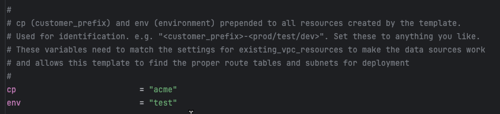

#### Existing VPC Resources

The FortiGate Autoscale Simplified Template is designed to attach to an existing customer TGW that may have one or multiple "spoke VPC's". These spoke VPC's may have existing resources that run some sort of workloads that generate egress traffic to the public internet (North-South) or traffic that passes between spoke VPC's (East-West) that may or may not need inspection before being allowed to pass between spoke VPC's. If no firwall inspection is needed for a given workload, then the TGW route tables can be configured to route the traffic directly between the spoke VPC's. If inspection is needed, then the traffic can be routed to the FortiGate Autoscale Group for inspection. 

The "existing_vpc_resources" template is a template that creates the resources described above and can be used to create demo or testing resources to generate test traffic when testing the Autoscale templates in non-production environments. This template can conditionally create the following resources:

To use this template, you will need to clone the following repository used for the content of this USE CASE: [FortiGate Simpliefied Autoscale Templates](https://github.com/FortinetCloudCSE/Autoscale-Simplified-Template.git)

After the repository is cloned, navigate to the "Autoscale-Simplified-Template/terraform/existing_vpc_resources" directory and copy the terraform.tfvars.example file to terraform.tfvars. 

Edit the terraform.tfvars file and provide values for the variables as needed.

Fill in the **aws_region** and **availability_zones** you would like to deploy in:

Fill in the **cp** and **env** variables. The values for these variables will be prepended to all resources created by the template.

#### Simplified Autoscale Template

Edit the terraform.tfvars file and provide values for the variables as needed.

Fill in the **aws_region** and **availability_zones** you would like to deploy in:

Fill in the **cp** and **env** variables. The values for these variables will be prepended to all resources created by the template.

**keypair** is the name of the keypair that will be used to create the EC2 instances. This keypair must exist in the region you are deploying to.
**my_ip** is the public IP used to create a security group that restricts access to those resources exposed to the public internet. 
**fortigate_asg_password** is the password that will be used to access the FortiGate instances for user **admin**.

**enable_tgw_attachment** is a boolean variable that will attach the Inspection VPC to the named TGW.  
**attach_to_tgw_name** is the name of the TGW that the Inspection VPC will attach to. The default is the name of the TGW created by the existing_vpc_resources template.

Follow the comments to fill in the rest of the variables as needed.

