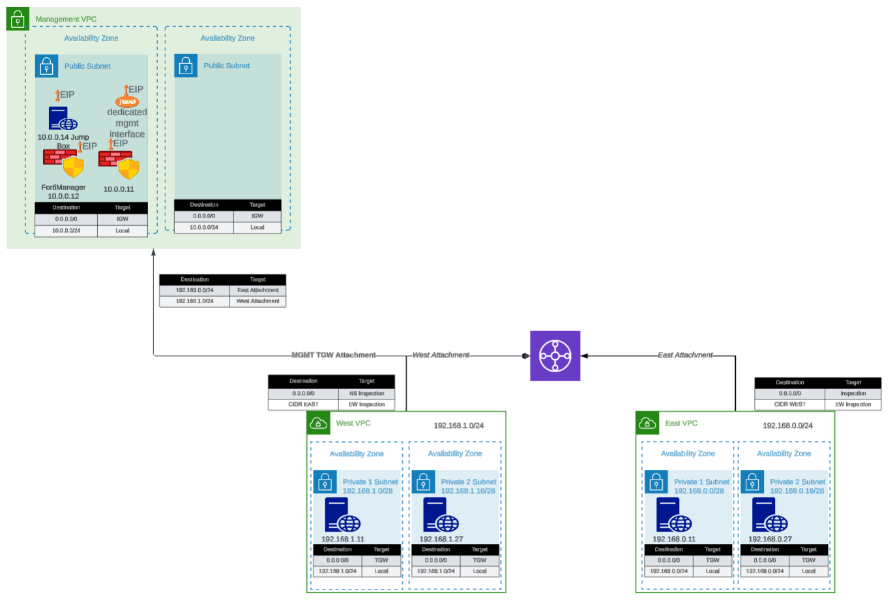

## Overview

The `existing_vpc_resources` template creates the **Inspection VPC** and supporting infrastructure required for the FortiGate autoscale deployment. All resources are tagged with `Fortinet-Role` tags that allow the `autoscale_template` to discover and deploy into them.

{}
**This template must be run BEFORE autoscale_template**. The `autoscale_template` discovers VPCs using `Fortinet-Role` tags created by this template. If you skip this template, you must manually apply the required tags to your existing VPCs.
{}

---

## What It Creates



The template conditionally creates the following components based on boolean variables. All resources are tagged with `Fortinet-Role` tags for discovery by `autoscale_template`.

### Component Overview

| Component | Purpose | Required | Typical Cost/Month |
|-----------|---------|----------|-------------------|
| **Inspection VPC** | **VPC for FortiGate autoscale deployment** | **Yes** | ~$50 (VPC/networking) |
| Management VPC | Centralized management infrastructure | No | ~$50 (VPC/networking) |
| FortiManager | Policy management and orchestration | No | ~$73 (m5.large) |
| FortiAnalyzer | Logging and reporting | No | ~$73 (m5.large) |
| Jump Box | Bastion host for secure access | No | ~$7 (t3.micro) |
| Transit Gateway | Central hub for VPC interconnectivity | No | ~$36 + data transfer |
| Spoke VPCs (East/West) | Simulated workload VPCs | No | ~$50 (networking) |
| Linux Instances | HTTP servers and traffic generators | No | ~$14 (2x t3.micro) |

**Total estimated cost for complete lab**: ~$300-400/month

---

## Component Details

### 0. Inspection VPC (Required)

**Purpose**: The VPC where FortiGate autoscale group will be deployed by `autoscale_template`

**Configuration variable**:
```hcl
enable_build_inspection_vpc = true
```

**What gets created**:
```
Inspection VPC (10.0.0.0/16)
├── Public Subnet AZ1 (FortiGate login/management)
├── Public Subnet AZ2
├── GWLBE Subnet AZ1 (Gateway Load Balancer Endpoints)
├── GWLBE Subnet AZ2
├── Private Subnet AZ1 (TGW attachment)
├── Private Subnet AZ2
├── Management Subnet AZ1 (optional - dedicated management ENI)
├── Management Subnet AZ2 (optional)
├── Internet Gateway
├── NAT Gateways (optional - if nat_gw mode)
├── Route Tables (per subnet type and AZ)
└── TGW Attachment (optional - if TGW enabled)
```

**Fortinet-Role tags applied** (for autoscale_template discovery):

| Resource | Fortinet-Role Tag |
|----------|-------------------|
| VPC | `{cp}-{env}-inspection-vpc` |
| IGW | `{cp}-{env}-inspection-igw` |
| Public Subnet AZ1 | `{cp}-{env}-inspection-public-az1` |
| Public Subnet AZ2 | `{cp}-{env}-inspection-public-az2` |
| GWLBE Subnet AZ1 | `{cp}-{env}-inspection-gwlbe-az1` |
| GWLBE Subnet AZ2 | `{cp}-{env}-inspection-gwlbe-az2` |
| Private Subnet AZ1 | `{cp}-{env}-inspection-private-az1` |
| Private Subnet AZ2 | `{cp}-{env}-inspection-private-az2` |
| Public RT AZ1 | `{cp}-{env}-inspection-public-rt-az1` |
| Public RT AZ2 | `{cp}-{env}-inspection-public-rt-az2` |
| GWLBE RT AZ1 | `{cp}-{env}-inspection-gwlbe-rt-az1` |
| GWLBE RT AZ2 | `{cp}-{env}-inspection-gwlbe-rt-az2` |
| Private RT AZ1 | `{cp}-{env}-inspection-private-rt-az1` |
| Private RT AZ2 | `{cp}-{env}-inspection-private-rt-az2` |
| NAT GW AZ1 | `{cp}-{env}-inspection-natgw-az1` (if nat_gw mode) |
| NAT GW AZ2 | `{cp}-{env}-inspection-natgw-az2` (if nat_gw mode) |
| TGW Attachment | `{cp}-{env}-inspection-tgw-attachment` (if TGW enabled) |
| TGW Route Table | `{cp}-{env}-inspection-tgw-rtb` (if TGW enabled) |

**Example**: For `cp="acme"` and `env="test"`, tags would be `acme-test-inspection-vpc`, `acme-test-inspection-public-az1`, etc.

{}
**Critical Variable Coordination**

The `cp` and `env` values used here **must match exactly** in `autoscale_template` for tag discovery to work. Mismatched values will cause `autoscale_template` to fail with "no matching VPC found" errors.
{}

#### Inspection VPC Internet Mode

```hcl
inspection_access_internet_mode = "nat_gw"  # or "eip"
```

- **nat_gw**: Creates NAT Gateways for FortiGate internet access (recommended for production)
- **eip**: FortiGates use Elastic IPs directly (simpler, lower cost)

#### Inspection VPC Dedicated Management ENI

```hcl
inspection_enable_dedicated_management_eni = true
```

Creates additional management subnets within the Inspection VPC for dedicated management interfaces on FortiGate instances.

---

### 1. Management VPC (Optional)

**Purpose**: Centralized management infrastructure isolated from production traffic

**Components**:
- Dedicated VPC with public and private subnets across two Availability Zones
- Internet Gateway for external connectivity
- Security groups for management traffic
- `Fortinet-Role` tags for discovery by `autoscale_template`

**Configuration variable**:
```hcl
enable_build_management_vpc = true
```

**What gets created**:
```
Management VPC (10.3.0.0/16)
├── Public Subnet AZ1 (10.3.1.0/24)
├── Public Subnet AZ2 (10.3.2.0/24)
├── Internet Gateway
└── Route Tables
```

**Fortinet-Role tags applied** (for autoscale_template discovery):

| Resource | Fortinet-Role Tag |
|----------|-------------------|
| VPC | `{cp}-{env}-management-vpc` |
| Public Subnet AZ1 | `{cp}-{env}-management-public-az1` |
| Public Subnet AZ2 | `{cp}-{env}-management-public-az2` |

#### FortiManager (Optional within Management VPC)

**Configuration**:
```hcl
enable_fortimanager = true
fortimanager_instance_type = "m5.large"
fortimanager_os_version = "7.4.5"
fortimanager_host_ip = "10"  # Results in .3.0.10
```

**Access**:
- GUI: `https://<FortiManager-Public-IP>`
- SSH: `ssh admin@<FortiManager-Public-IP>`
- Default credentials: `admin` / `<instance-id>`

**Use cases**:
- Testing FortiManager integration with autoscale group
- Centralized policy management demonstrations
- Device orchestration testing

#### FortiAnalyzer (Optional within Management VPC)

**Configuration**:
```hcl
enable_fortianalyzer = true
fortianalyzer_instance_type = "m5.large"
fortianalyzer_os_version = "7.4.5"
fortianalyzer_host_ip = "11"  # Results in .3.0.11
```

**Access**:
- GUI: `https://<FortiAnalyzer-Public-IP>`
- SSH: `ssh admin@<FortiAnalyzer-Public-IP>`
- Default credentials: `admin` / `<instance-id>`

**Use cases**:
- Centralized logging for autoscale group
- Reporting and analytics demonstrations
- Log retention testing

#### Jump Box (Optional within Management VPC)

**Configuration**:
```hcl
enable_jump_box = true
jump_box_instance_type = "t3.micro"
```

**Access**:
```bash
ssh -i ~/.ssh/keypair.pem ec2-user@<jump-box-public-ip>
```

**Use cases**:
- Secure access to spoke VPC instances
- Testing connectivity without FortiGate in path (via debug attachment)
- Management access to FortiGate private IPs

#### Management VPC TGW Attachment (Optional)

**Configuration**:
```hcl
enable_mgmt_vpc_tgw_attachment = true
```

**Purpose**: Connects management VPC to Transit Gateway, allowing:
- Jump box access to spoke VPC Linux instances
- FortiManager/FortiAnalyzer access to FortiGate instances via TGW
- Alternative management access paths

**Routing**: 
- Management VPC → TGW → Spoke VPCs
- Can be combined with `enable_debug_tgw_attachment` for bypass testing

---

### 2. Transit Gateway and Spoke VPCs (Optional)

**Purpose**: Simulates production multi-VPC environment for traffic generation and testing

**Configuration variable**:
```hcl
enable_build_existing_subnets = true
```

**What gets created**:
```
Transit Gateway
├── East Spoke VPC (192.168.0.0/24)
│   ├── Public Subnet AZ1
│   ├── Private Subnet AZ1
│   ├── NAT Gateway (optional)
│   └── Linux Instance (optional)
│
├── West Spoke VPC (192.168.1.0/24)
│   ├── Public Subnet AZ1
│   ├── Private Subnet AZ1
│   ├── NAT Gateway (optional)
│   └── Linux Instance (optional)
│
└── TGW Route Tables
    ├── Spoke-to-Spoke (via inspection VPC)
    └── Inspection-to-Internet
```

#### Transit Gateway

**Configuration**:
```hcl
# Created automatically when enable_build_existing_subnets = true
# Named: {cp}-{env}-tgw
```

**Purpose**:
- Central hub for VPC interconnectivity
- Enables centralized egress architecture
- Allows east-west traffic inspection

**Attachments**:
- East Spoke VPC
- West Spoke VPC
- Inspection VPC (created by autoscale_template)
- Management VPC (if `enable_mgmt_vpc_tgw_attachment = true`)
- Debug attachment (if `enable_debug_tgw_attachment = true`)

#### Spoke VPCs (East and West)

**Configuration**:
```hcl
vpc_cidr_east = "192.168.0.0/24"
vpc_cidr_west = "192.168.1.0/24"
vpc_cidr_spoke = "192.168.0.0/16"  # Supernet
```

**Components per spoke VPC**:
- Public and private subnets
- NAT Gateway for internet egress
- Route tables for internet and TGW connectivity
- Security groups for instance access

#### Linux Instances (Traffic Generators)

**Configuration**:
```hcl
enable_east_linux_instances = true
east_linux_instance_type = "t3.micro"

enable_west_linux_instances = true
west_linux_instance_type = "t3.micro"
```

**What they provide**:
- HTTP server on port 80 (for connectivity testing)
- Internet egress capability (for testing FortiGate inspection)
- East-West traffic generation between spoke VPCs

**Testing with Linux instances**:
```bash
# From jump box or another instance
curl http://<linux-instance-ip>
# Returns: "Hello from <hostname>"

# Generate internet egress traffic
ssh ec2-user@<linux-instance-ip>
curl http://www.google.com  # Traffic goes through FortiGate
```

#### Debug TGW Attachment (Optional)

**Configuration**:
```hcl
enable_debug_tgw_attachment = true
```

**Purpose**: Creates a **bypass attachment** from Management VPC directly to Transit Gateway, allowing traffic to flow:
```
Jump Box → TGW → Spoke VPC Linux Instances (bypassing FortiGate inspection)
```

**Debug path use cases**:
- Validate spoke VPC connectivity independent of FortiGate inspection
- Compare latency/throughput with and without inspection
- Troubleshoot routing issues by eliminating FortiGate as variable
- Generate baseline traffic patterns for capacity planning

{}
**Security Consideration**

The debug attachment bypasses FortiGate inspection entirely. **Do not enable in production environments**. This is strictly for testing and validation purposes.
{}

---

## Configuration Scenarios

### Scenario 1: Complete Lab Environment

**Use case**: Full-featured lab for testing all capabilities

```hcl
# Inspection VPC (Required)
enable_build_inspection_vpc            = true
inspection_access_internet_mode        = "nat_gw"
inspection_enable_dedicated_management_eni = false

# Management VPC Components
enable_build_management_vpc    = true
enable_fortimanager            = true
enable_fortianalyzer           = true
enable_jump_box                = true
enable_mgmt_vpc_tgw_attachment = true

# Spoke VPC Components
enable_build_existing_subnets  = true
enable_east_linux_instances    = true
enable_west_linux_instances    = true
enable_debug_tgw_attachment    = true
```

**What you get**: Complete environment with inspection VPC (with Fortinet-Role tags), management, spoke VPCs, traffic generators, and debug path

**Cost**: ~$300-400/month

**Best for**: Training, demonstrations, comprehensive testing

---

### Scenario 2: Inspection + Management VPC Only

**Use case**: Testing FortiManager/FortiAnalyzer integration without spoke VPCs

```hcl
# Inspection VPC (Required)
enable_build_inspection_vpc            = true
inspection_access_internet_mode        = "eip"

# Management VPC Components
enable_build_management_vpc    = true
enable_fortimanager            = true
enable_fortianalyzer           = true
enable_jump_box                = false
enable_mgmt_vpc_tgw_attachment = false

# Spoke VPC Components
enable_build_existing_subnets  = false
```

**What you get**: Inspection VPC (with Fortinet-Role tags) and Management VPC with FortiManager and FortiAnalyzer

**Cost**: ~$200/month

**Best for**: FortiManager/FortiAnalyzer integration testing, centralized management evaluation

---

### Scenario 3: Inspection VPC + Traffic Generation

**Use case**: Testing autoscale with traffic generators, no management VPC

```hcl
# Inspection VPC (Required)
enable_build_inspection_vpc            = true
inspection_access_internet_mode        = "nat_gw"

# Management VPC Components
enable_build_management_vpc    = false

# Spoke VPC Components
enable_build_existing_subnets  = true
enable_east_linux_instances    = true
enable_west_linux_instances    = true
enable_debug_tgw_attachment    = false
```

**What you get**: Inspection VPC (with Fortinet-Role tags), Transit Gateway, and spoke VPCs with Linux instances

**Cost**: ~$100-150/month

**Best for**: Autoscale behavior testing, load testing, capacity planning

---

### Scenario 4: Minimal Inspection VPC Only

**Use case**: Lowest cost configuration - Inspection VPC only

```hcl
# Inspection VPC (Required)
enable_build_inspection_vpc            = true
inspection_access_internet_mode        = "eip"  # Lower cost than nat_gw

# Management VPC Components
enable_build_management_vpc    = false

# Spoke VPC Components
enable_build_existing_subnets  = false
```

**What you get**: Inspection VPC with Fortinet-Role tags only - minimum required for autoscale_template

**Cost**: ~$30-50/month (VPC infrastructure only)

**Best for**: Minimal FortiGate testing, cost-sensitive environments, integration with existing TGW/spoke VPCs

---

## Step-by-Step Deployment

### Prerequisites

- AWS account with appropriate permissions
- Terraform 1.0 or later installed
- AWS CLI configured with credentials
- Git installed
- SSH keypair created in target AWS region

### Step 1: Clone the Repository

Clone the repository containing both templates:

```bash
git clone https://github.com/FortinetCloudCSE/Autoscale-Simplified-Template.git
cd Autoscale-Simplified-Template/terraform/existing_vpc_resources
```


### Step 2: Create terraform.tfvars

Copy the example file and customize:

```bash
cp terraform.tfvars.example terraform.tfvars
```

### Step 3: Configure Core Variables

#### Region and Availability Zones


```hcl
aws_region         = "us-west-2"
availability_zone_1 = "a"
availability_zone_2 = "c"
```

{}
**Availability Zone Selection**

Choose AZs that:
- Support your desired instance types
- Have sufficient capacity
- Match your production environment (if testing for production)

Verify AZ availability:
```bash
aws ec2 describe-availability-zones --region us-west-2
```
{}

#### Customer Prefix and Environment


These values are prepended to all resources for identification:

```hcl
cp  = "acme"    # Customer prefix
env = "test"    # Environment: prod, test, dev
```

**Result**: Resources named like `acme-test-management-vpc`, `acme-test-tgw`, etc.


{}
**Critical: Variable Coordination**

These `cp` and `env` values **must match** between `existing_vpc_resources` and `autoscale_template` for proper resource discovery via tags.
{}

### Step 4: Configure Component Flags

#### Inspection VPC (Required)

The Inspection VPC is **required** and must be enabled. This creates the VPC where FortiGate autoscale group will be deployed.

```hcl
enable_build_inspection_vpc            = true
inspection_access_internet_mode        = "nat_gw"  # or "eip"
inspection_enable_dedicated_management_eni = false  # or true for dedicated mgmt ENI
```

{}
**Fortinet-Role Tags**: All Inspection VPC resources are automatically tagged with `Fortinet-Role` tags using the pattern `{cp}-{env}-inspection-*`. These tags are used by `autoscale_template` to discover the VPC resources.
{}

#### Management VPC (Optional)


```hcl
enable_build_management_vpc = true
```

#### Spoke VPCs and Transit Gateway (Optional)


```hcl
enable_build_existing_subnets = true
```

### Step 5: Configure Optional Components

#### FortiManager and FortiAnalyzer


```hcl
enable_fortimanager  = true
fortimanager_instance_type = "m5.large"
fortimanager_os_version = "7.4.5"
fortimanager_host_ip = "10"  # .3.0.10 within management VPC CIDR

enable_fortianalyzer = true
fortianalyzer_instance_type = "m5.large"
fortianalyzer_os_version = "7.4.5"
fortianalyzer_host_ip = "11"  # .3.0.11 within management VPC CIDR
```

{}
**Instance Sizing Recommendations**

For testing/lab environments:
- FortiManager: m5.large (minimum)
- FortiAnalyzer: m5.large (minimum)

For heavier workloads or production evaluation:
- FortiManager: m5.xlarge or m5.2xlarge
- FortiAnalyzer: m5.xlarge or larger (depends on log volume)
{}

#### Management VPC Transit Gateway Attachment


```hcl
enable_mgmt_vpc_tgw_attachment = true
```

This allows jump box and management instances to reach spoke VPC Linux instances for testing.

#### Linux Traffic Generators


```hcl
enable_jump_box = true
jump_box_instance_type = "t3.micro"

enable_east_linux_instances = true
east_linux_instance_type = "t3.micro"

enable_west_linux_instances = true
west_linux_instance_type = "t3.micro"
```

#### Debug TGW Attachment

```hcl
enable_debug_tgw_attachment = true
```

Enables bypass path for connectivity testing without FortiGate inspection.

### Step 6: Configure Network CIDRs


```hcl
vpc_cidr_management = "10.3.0.0/16"
vpc_cidr_east       = "192.168.0.0/24"
vpc_cidr_west       = "192.168.1.0/24"
vpc_cidr_spoke      = "192.168.0.0/16"  # Supernet for all spoke VPCs
```

{}
**CIDR Planning**

Ensure CIDRs:
- Don't overlap with existing networks
- Match between `existing_vpc_resources` and `autoscale_template`
- Have sufficient address space for growth
- Align with corporate IP addressing standards
{}

### Step 7: Configure Security Variables

```hcl
keypair = "my-aws-keypair"  # Must exist in target region
my_ip   = "203.0.113.10/32" # Your public IP for SSH access
```

{}
**Security Group Source IP**

The `my_ip` variable restricts SSH and HTTPS access to management interfaces. 

For dynamic IPs, consider:
- Using a CIDR range: `"203.0.113.0/24"`
- VPN endpoint IP if accessing via corporate VPN
- Multiple IPs: Configure directly in security groups after deployment
{}

### Step 8: Deploy the Template

Initialize Terraform:
```bash
terraform init
```

Review the execution plan:
```bash
terraform plan
```

Expected output will show resources to be created based on enabled flags.

Deploy the infrastructure:
```bash
terraform apply
```

Type `yes` when prompted to confirm.

**Expected deployment time**: 10-15 minutes

**Deployment progress**:
```
Apply complete! Resources: 47 added, 0 changed, 0 destroyed.

Outputs:

east_linux_instance_ip = "192.168.0.50"
fortianalyzer_public_ip = "52.10.20.30"
fortimanager_public_ip = "52.10.20.40"
jump_box_public_ip = "52.10.20.50"
management_vpc_id = "vpc-0123456789abcdef0"
tgw_id = "tgw-0123456789abcdef0"
tgw_name = "acme-test-tgw"
west_linux_instance_ip = "192.168.1.50"
```

### Step 9: Verify Deployment

#### Verify Management VPC

```bash
aws ec2 describe-vpcs --filters "Name=tag:Name,Values=acme-test-management-vpc"
```

Expected: VPC ID and CIDR information

#### Access FortiManager (if enabled)

```bash
# Get public IP from outputs
terraform output fortimanager_public_ip

# Access GUI
open https://<FortiManager-Public-IP>

# Or SSH
ssh admin@<FortiManager-Public-IP>
# Default password: <instance-id>
```

**First-time FortiManager setup**:
1. Login with admin / instance-id
2. Change password when prompted
3. Complete initial setup wizard
4. Navigate to Device Manager > Device & Groups

**Enable VM device recognition** (FortiManager 7.6.3+):
```
config system global
    set fgfm-allow-vm enable
end
```

#### Access FortiAnalyzer (if enabled)

```bash
# Get public IP from outputs
terraform output fortianalyzer_public_ip

# Access GUI
open https://<FortiAnalyzer-Public-IP>

# Or SSH  
ssh admin@<FortiAnalyzer-Public-IP>
```

#### Verify Transit Gateway (if enabled)

```bash
aws ec2 describe-transit-gateways --filters "Name=tag:Name,Values=acme-test-tgw"
```

Expected: Transit Gateway in "available" state

#### Test Linux Instances (if enabled)

```bash
# Get instance IPs from outputs
terraform output east_linux_instance_ip
terraform output west_linux_instance_ip

# Test HTTP connectivity (if jump box enabled)
ssh -i ~/.ssh/keypair.pem ec2-user@<jump-box-ip>
curl http://<east-linux-ip>
# Expected: "Hello from ip-192-168-0-50"
```

### Step 10: Save Outputs for autoscale_template

Save key outputs for use in `autoscale_template` configuration:

```bash
# Save all outputs
terraform output > ../outputs.txt

# Or save specific values
echo "tgw_name: $(terraform output -raw tgw_name)" >> ../autoscale_template/terraform.tfvars
echo "fortimanager_ip: $(terraform output -raw fortimanager_private_ip)" >> ../autoscale_template/terraform.tfvars
```

---

## Outputs Reference

The template provides these outputs. Note that `autoscale_template` discovers resources via `Fortinet-Role` tags rather than using output values directly.

### Inspection VPC Outputs

| Output | Description | Notes |
|--------|-------------|-------|
| `inspection_vpc_id` | ID of inspection VPC | Discovered by autoscale_template via Fortinet-Role tag |
| `inspection_vpc_cidr` | CIDR of inspection VPC | Used for route table configuration |

### Management and Supporting Infrastructure Outputs

| Output | Description | Used By autoscale_template |
|--------|-------------|-------------------------|
| `management_vpc_id` | ID of management VPC | VPC peering or TGW routing |
| `management_vpc_cidr` | CIDR of management VPC | Route table configuration |
| `tgw_id` | Transit Gateway ID | TGW attachment |
| `tgw_name` | Transit Gateway name tag | `attach_to_tgw_name` variable |
| `fortimanager_private_ip` | FortiManager private IP | `fortimanager_ip` variable |
| `fortimanager_public_ip` | FortiManager public IP | GUI/SSH access |
| `fortianalyzer_private_ip` | FortiAnalyzer private IP | FortiGate syslog configuration |
| `fortianalyzer_public_ip` | FortiAnalyzer public IP | GUI/SSH access |
| `jump_box_public_ip` | Jump box public IP | SSH bastion access |
| `east_linux_instance_ip` | East spoke instance IP | Connectivity testing |
| `west_linux_instance_ip` | West spoke instance IP | Connectivity testing |

{}
**Tag-Based Discovery**: The `autoscale_template` discovers Inspection VPC resources using `Fortinet-Role` tags rather than relying on output values. This allows the templates to be run independently as long as the `cp` and `env` values match.
{}

---

## Post-Deployment Configuration

### Configure FortiManager for Integration

If you enabled FortiManager and plan to integrate with autoscale group:

1. **Access FortiManager GUI**: `https://<FortiManager-Public-IP>`

2. **Change default password**:
   - Login with `admin` / `<instance-id>`
   - Follow password change prompts

3. **Enable VM device recognition** (7.6.3+):
   ```
   config system global
       set fgfm-allow-vm enable
   end
   ```

4. **Create ADOM for autoscale group** (optional):
   - Device Manager > ADOM
   - Create ADOM for organizing autoscale FortiGates

5. **Note FortiManager details** for autoscale_template:
   - Private IP: From outputs
   - Serial number: Get from CLI: `get system status`

### Configure FortiAnalyzer for Logging

If you enabled FortiAnalyzer:

1. **Access FortiAnalyzer GUI**: `https://<FortiAnalyzer-Public-IP>`

2. **Change default password**

3. **Configure log settings**:
   - System Settings > Storage
   - Configure log retention policies
   - Enable features needed for testing

4. **Note FortiAnalyzer private IP** for FortiGate syslog configuration

---

## Important Notes

### Resource Lifecycle Considerations

{}
**Management Resource Persistence**

If you deploy the `existing_vpc_resources` template:
- Management VPC and resources (FortiManager, FortiAnalyzer) will be **destroyed** when you run `terraform destroy`
- If you want management resources to persist across inspection VPC redeployments, consider:
  - Deploying management VPC separately with different Terraform state
  - Using existing management infrastructure instead of template-created resources
  - Setting appropriate lifecycle rules in Terraform to prevent destruction
{}

### Cost Optimization Tips

{}
**Managing Lab Costs**

The `existing_vpc_resources` template can create expensive resources:
- FortiManager m5.large: ~$0.10/hour (~$73/month)
- FortiAnalyzer m5.large: ~$0.10/hour (~$73/month)
- Transit Gateway: $0.05/hour (~$36/month) + data processing charges
- NAT Gateways: $0.045/hour each (~$33/month each)

**Cost reduction strategies**:
- Use smaller instance types (t3.micro, t3.small) where possible
- Disable FortiManager/FortiAnalyzer if not testing those features
- **Destroy resources when not actively testing**
- Use AWS Cost Explorer to monitor spend
- Consider AWS budgets and alerts

**Example budget-conscious configuration**:
```hcl
enable_fortimanager = false    # Save $73/month
enable_fortianalyzer = false   # Save $73/month
jump_box_instance_type = "t3.micro"  # Use smallest size
east_linux_instance_type = "t3.micro"
west_linux_instance_type = "t3.micro"
```
{}

### State File Management

Store Terraform state securely:

```hcl
# backend.tf (optional - recommended for teams)
terraform {
  backend "s3" {
    bucket = "my-terraform-state"
    key    = "existing-vpc-resources/terraform.tfstate"
    region = "us-west-2"
    encrypt = true
    dynamodb_table = "terraform-locks"
  }
}
```

---

## Troubleshooting

### Issue: Terraform Fails with "Resource Already Exists"

**Symptoms**:
```
Error: Error creating VPC: VpcLimitExceeded
```

**Solutions**:
- Check VPC limits in your AWS account
- Clean up unused VPCs
- Request limit increase via AWS Support

### Issue: Cannot Access FortiManager/FortiAnalyzer

**Symptoms**:
- Timeout when accessing GUI
- SSH connection refused

**Solutions**:
1. Verify security groups allow your IP:
   ```bash
   aws ec2 describe-security-groups --group-ids <sg-id>
   ```

2. Check instance is running:
   ```bash
   aws ec2 describe-instances --filters "Name=tag:Name,Values=*fortimanager*"
   ```

3. Verify `my_ip` variable matches your current public IP:
   ```bash
   curl ifconfig.me
   ```

4. Check instance system log for boot issues:
   ```bash
   aws ec2 get-console-output --instance-id <instance-id>
   ```

### Issue: Transit Gateway Attachment Pending

**Symptoms**:
- TGW attachment stuck in "pending" state
- Spoke VPCs can't communicate

**Solutions**:
1. Wait 5-10 minutes for attachment to complete
2. Check TGW route tables are configured
3. Verify no CIDR overlaps between VPCs
4. Check TGW attachment state:
   ```bash
   aws ec2 describe-transit-gateway-attachments
   ```

### Issue: Linux Instances Not Reachable

**Symptoms**:
- Cannot curl or SSH to Linux instances

**Solutions**:
1. Verify you're accessing from jump box (if not public)
2. Check security groups allow port 80 and 22
3. Verify NAT Gateway is functioning for internet access
4. Check route tables in spoke VPCs

### Issue: High Costs After Deployment

**Symptoms**:
- AWS bill higher than expected

**Solutions**:
1. Check what's running:
   ```bash
   aws ec2 describe-instances --filters "Name=instance-state-name,Values=running"
   ```

2. Identify expensive resources:
   ```bash
   # Use AWS Cost Explorer in AWS Console
   # Filter by resource tags: cp and env
   ```

3. Shut down unused components:
   ```bash
   terraform destroy -target=module.fortimanager
   terraform destroy -target=module.fortianalyzer
   ```

4. Or destroy entire deployment:
   ```bash
   terraform destroy
   ```

---

## Cleanup

### Destroying Resources

To destroy the `existing_vpc_resources` infrastructure:

```bash
cd terraform/existing_vpc_resources
terraform destroy
```

Type `yes` when prompted.

{}
**Destroy Order is Critical**

If you also deployed `autoscale_template`, **destroy it FIRST** before destroying `existing_vpc_resources`:

```bash
# Step 1: Destroy autoscale_template
cd terraform/autoscale_template
terraform destroy

# Step 2: Destroy existing_vpc_resources  
cd ../existing_vpc_resources
terraform destroy
```

**Why?** The inspection VPC has a Transit Gateway attachment to the TGW created by `existing_vpc_resources`. Destroying the TGW first will cause the attachment deletion to fail.
{}

### Selective Cleanup

To destroy only specific components:

```bash
# Destroy only FortiManager
terraform destroy -target=module.fortimanager

# Destroy only spoke VPCs and TGW
terraform destroy -target=module.transit_gateway
terraform destroy -target=module.spoke_vpcs

# Destroy only management VPC
terraform destroy -target=module.management_vpc
```

### Verify Complete Cleanup

After destroying, verify no resources remain:

```bash
# Check VPCs
aws ec2 describe-vpcs --filters "Name=tag:cp,Values=acme" "Name=tag:env,Values=test"

# Check Transit Gateways
aws ec2 describe-transit-gateways --filters "Name=tag:cp,Values=acme"

# Check running instances
aws ec2 describe-instances --filters "Name=instance-state-name,Values=running" "Name=tag:cp,Values=acme"
```

---

## Next Steps

After deploying `existing_vpc_resources`, proceed to deploy the [autoscale_template](../5_3_autoscale_template/) to create the FortiGate autoscale group and inspection VPC.

**Key information to carry forward**:
- Transit Gateway name (from outputs)
- FortiManager private IP (if enabled)
- FortiAnalyzer private IP (if enabled)
- Same `cp` and `env` values

**Recommended next reading**:
- [autoscale_template Deployment Guide](../5_3_autoscale_template/)
- [FortiManager Integration Configuration](../../4_solution_components/4_5_fortimanager_integration/)
- [Licensing Options](../../3_licensing/)
