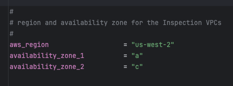

## Overview

The `unified_template` is the **required** Terraform template that deploys the core FortiGate autoscale infrastructure. This template is used for **all deployments** and can operate independently or integrate with resources created by the [existing_vpc_resources](../5_2_existing_vpc_resources/) template.

{}
**This template is required for all deployments**. It creates the inspection VPC, FortiGate autoscale group, Gateway Load Balancer, and all components necessary for traffic inspection.
{}

---

## What It Creates

The unified_template deploys a complete FortiGate autoscale solution including:

### Core Components

| Component | Purpose | Always Created |
|-----------|---------|----------------|
| **Inspection VPC** | Dedicated VPC for FortiGate instances and GWLB | ✅ Yes |
| **FortiGate Autoscale Groups** | BYOL and/or on-demand instance groups | ✅ Yes |
| **Gateway Load Balancer** | Distributes traffic across FortiGate instances | ✅ Yes |
| **GWLB Endpoints** | Connection points in each AZ | ✅ Yes |
| **Lambda Functions** | Lifecycle management and licensing automation | ✅ Yes |
| **DynamoDB Table** | License tracking and state management | ✅ Yes (if BYOL) |
| **S3 Bucket** | License file storage and Lambda code | ✅ Yes (if BYOL) |
| **IAM Roles** | Permissions for Lambda and EC2 instances | ✅ Yes |
| **Security Groups** | Network access control | ✅ Yes |
| **CloudWatch Alarms** | Autoscaling triggers | ✅ Yes |

### Optional Components

| Component | Purpose | Enabled By |
|-----------|---------|-----------|
| **Transit Gateway Attachment** | Connection to TGW for centralized architecture | `enable_tgw_attachment` |
| **Dedicated Management ENI** | Isolated management interface | `enable_dedicated_management_eni` |
| **Dedicated Management VPC Connection** | Management in separate VPC | `enable_dedicated_management_vpc` |
| **FortiManager Integration** | Centralized policy management | `enable_fortimanager_integration` |
| **East-West Inspection** | Inter-spoke traffic inspection | `enable_east_west_inspection` |

---

## Architecture Patterns

The unified_template supports multiple deployment patterns:

### Pattern 1: Centralized Architecture with TGW

**Configuration**:
```hcl
enable_tgw_attachment = true
attach_to_tgw_name = "production-tgw"
```

**Traffic flow**:
```
Spoke VPCs → TGW → Inspection VPC → FortiGate → GWLB → Internet
```

**Use cases**:
- Production centralized egress
- Multi-VPC environments
- East-west traffic inspection

---

### Pattern 2: Distributed Architecture (No TGW)

**Configuration**:
```hcl
enable_tgw_attachment = false
```

**Traffic flow**:
```
Spoke VPC → GWLB Endpoint → FortiGate → Internet Gateway
```

**Use cases**:
- Distributed security architecture
- Per-VPC inspection requirements
- Bump-in-the-wire deployments

---

### Pattern 3: Hybrid with Management VPC

**Configuration**:
```hcl
enable_tgw_attachment = true
enable_dedicated_management_vpc = true
enable_fortimanager_integration = true
```

**Traffic flow**:
```
Data: Spoke VPCs → TGW → FortiGate → Internet
Management: FortiGate → Management VPC → FortiManager
```

**Use cases**:
- Enterprise deployments
- Centralized management requirements
- Compliance-driven architectures

---

## Integration Modes

### Integration with existing_vpc_resources

When deploying after `existing_vpc_resources`:

**Required variable coordination**:
```hcl
# Must match existing_vpc_resources values
aws_region          = "us-west-2"
availability_zone_1 = "a"
availability_zone_2 = "c"
cp                  = "acme"      # MUST MATCH
env                 = "test"      # MUST MATCH

# Connect to created TGW
enable_tgw_attachment = true
attach_to_tgw_name    = "acme-test-tgw"  # From existing_vpc_resources output

# Connect to management VPC (if created)
enable_dedicated_management_vpc = true
dedicated_management_vpc_tag = "acme-test-management-vpc"
dedicated_management_public_az1_subnet_tag = "acme-test-management-public-az1-subnet"
dedicated_management_public_az2_subnet_tag = "acme-test-management-public-az2-subnet"

# FortiManager integration (if enabled in existing_vpc_resources)
enable_fortimanager_integration = true
fortimanager_ip = "10.3.0.10"  # From existing_vpc_resources output
fortimanager_sn = "FMGVM0000000001"
```

---

### Integration with Existing Production Infrastructure

When deploying to existing production environment:

**Required information**:
- Existing Transit Gateway name (or skip TGW entirely)
- Existing management VPC details (or skip)
- Network CIDR ranges to avoid overlaps

**Configuration**:
```hcl
# Connect to existing production TGW
enable_tgw_attachment = true
attach_to_tgw_name = "production-tgw"  # Your existing TGW

# Use existing management infrastructure
enable_fortimanager_integration = true
fortimanager_ip = "10.100.50.10"  # Your existing FortiManager
fortimanager_sn = "FMGVM1234567890"
```

---

## Step-by-Step Deployment

### Prerequisites

- ✅ AWS account with appropriate permissions
- ✅ Terraform 1.0 or later installed
- ✅ AWS CLI configured with credentials
- ✅ SSH keypair created in target AWS region
- ✅ FortiGate licenses (if using BYOL) or FortiFlex account (if using FortiFlex)
- ✅ `existing_vpc_resources` deployed (if using lab environment)

### Step 1: Navigate to Template Directory

```bash
cd Autoscale-Simplified-Template/terraform/unified_template
```

### Step 2: Create terraform.tfvars

```bash
cp terraform.tfvars.example terraform.tfvars
```

### Step 3: Configure Core Variables

#### Region and Availability Zones



```hcl
aws_region         = "us-west-2"
availability_zone_1 = "a"
availability_zone_2 = "c"
```

{}
**Variable Coordination**

If you deployed `existing_vpc_resources`, these values **MUST MATCH** exactly:
- `aws_region`
- `availability_zone_1`
- `availability_zone_2`
- `cp` (customer prefix)
- `env` (environment)

Mismatched values will cause resource discovery failures and deployment errors.
{}

#### Customer Prefix and Environment


```hcl
cp  = "acme"    # Customer prefix
env = "test"    # Environment: prod, test, dev
```

### Step 4: Configure Security Variables


```hcl
keypair                 = "my-aws-keypair"  # Must exist in target region
my_ip                   = "203.0.113.10/32" # Your public IP for management access
fortigate_asg_password  = "SecurePassword123!"  # Admin password for FortiGates
```

{}
**Password Requirements**

The `fortigate_asg_password` must meet FortiOS password requirements:
- Minimum 8 characters
- At least one uppercase letter
- At least one lowercase letter
- At least one number
- No special characters that might cause shell escaping issues

**Never commit passwords to version control**. Consider using:
- Terraform variables marked as sensitive
- Environment variables: `TF_VAR_fortigate_asg_password`
- AWS Secrets Manager
- HashiCorp Vault
{}

### Step 5: Configure Transit Gateway Integration


**To connect to Transit Gateway**:

```hcl
enable_tgw_attachment = true
```


**Specify TGW name**:

```hcl
# If using existing_vpc_resources template
attach_to_tgw_name = "acme-test-tgw"  # Matches existing_vpc_resources output

# If using existing production TGW
attach_to_tgw_name = "production-tgw"  # Your production TGW name
```

{}
**Finding Your Transit Gateway Name**

If you don't know your TGW name:
```bash
aws ec2 describe-transit-gateways \
  --query 'TransitGateways[*].[Tags[?Key==`Name`].Value | [0], TransitGatewayId]' \
  --output table
```

The `attach_to_tgw_name` should match the `Name` tag of your Transit Gateway.
{}

**To skip TGW attachment** (distributed architecture):

```hcl
enable_tgw_attachment = false
```

**East-West Inspection** (requires TGW attachment):

```hcl
enable_east_west_inspection = true  # Routes spoke-to-spoke traffic through FortiGate
```

### Step 6: Configure Architecture Options

#### Firewall Mode

```hcl
firewall_policy_mode = "2-arm"  # or "1-arm"
```

**Recommendations**:
- **2-arm**: Recommended for most deployments (better throughput)
- **1-arm**: Use when simplified routing is required

See [Firewall Architecture](../../4_solution_components/4_2_firewall_architecture/) for detailed comparison.

#### Internet Egress Mode

```hcl
access_internet_mode = "nat_gw"  # or "eip"
```

**Recommendations**:
- **nat_gw**: Production deployments (higher availability)
- **eip**: Lower cost, simpler architecture

See [Internet Egress](../../4_solution_components/4_1_internet_egress/) for detailed comparison.

### Step 7: Configure Management Options

#### Dedicated Management ENI

```hcl
enable_dedicated_management_eni = true
```

Separates management traffic from data plane. Recommended for production.

#### Dedicated Management VPC

```hcl
enable_dedicated_management_vpc = true

# If using existing_vpc_resources with default tags:
dedicated_management_vpc_tag = "acme-test-management-vpc"
dedicated_management_public_az1_subnet_tag = "acme-test-management-public-az1-subnet"
dedicated_management_public_az2_subnet_tag = "acme-test-management-public-az2-subnet"

# If using existing management VPC with custom tags:
dedicated_management_vpc_tag = "my-custom-mgmt-vpc-tag"
dedicated_management_public_az1_subnet_tag = "my-custom-mgmt-az1-tag"
dedicated_management_public_az2_subnet_tag = "my-custom-mgmt-az2-tag"
```

See [Management Isolation](../../4_solution_components/4_3_management_isolation/) for options and recommendations.

{}
**Automatic Implication**

When `enable_dedicated_management_vpc = true`, the template automatically sets `enable_dedicated_management_eni = true`. You don't need to configure both explicitly.
{}

### Step 8: Configure Licensing


The template supports three licensing models. Choose one or combine them for hybrid licensing.

#### Option 1: BYOL (Bring Your Own License)

```hcl
asg_license_directory = "asg_license"  # Directory containing .lic files
```

**Prerequisites**:
1. Create the license directory:
   ```bash
   mkdir asg_license
   ```

2. Place license files in the directory:
   ```
   terraform/unified_template/
   ├── terraform.tfvars
   ├── asg_license/
   │   ├── FGVM01-001.lic
   │   ├── FGVM01-002.lic
   │   ├── FGVM01-003.lic
   │   └── FGVM01-004.lic
   ```

3. Ensure you have **at least** as many licenses as `asg_byol_asg_max_size`

{}
**License Pool Exhaustion**

If you run out of BYOL licenses:
- New BYOL instances launch but remain unlicensed
- Unlicensed instances operate at 1 Mbps throughput
- FortiGuard services will not activate
- If on-demand ASG is configured, scaling continues using PAYG instances

**Recommended**: Provision 20% more licenses than `asg_byol_asg_max_size`
{}

#### Option 2: FortiFlex (API-Driven)

```hcl
fortiflex_username      = "xxxxxxxx-xxxx-xxxx-xxxx-xxxxxxxxxxxx"  # API username (UUID)
fortiflex_password      = "xxxxxxxxxxxxxxxxxxxxx"  # API password
fortiflex_sn_list       = ["FGVMELTMxxxxxxxx"]  # Optional: specific program serial numbers
fortiflex_configid_list = ["My_4CPU_Config"]  # Configuration names (must match CPU count)
```

**Prerequisites**:
1. Register FortiFlex program via FortiCare
2. Purchase point packs
3. Create configurations matching your instance types
4. Generate API credentials via IAM portal

**CPU count matching**:
```hcl
fgt_instance_type = "c6i.xlarge"  # 4 vCPUs
fortiflex_configid_list = ["My_4CPU_Config"]  # MUST have 4 CPUs configured
```

{}
**Security Best Practice**

Never commit FortiFlex credentials to version control. Use:
- Terraform Cloud sensitive variables
- AWS Secrets Manager
- Environment variables: `TF_VAR_fortiflex_username` and `TF_VAR_fortiflex_password`
- HashiCorp Vault

**Example using environment variables**:
```bash
export TF_VAR_fortiflex_username="xxxxxxxx-xxxx-xxxx-xxxx-xxxxxxxxxxxx"
export TF_VAR_fortiflex_password="xxxxxxxxxxxxxxxxxxxxx"
terraform apply
```
{}

See [FortiFlex Setup Guide](/mnt/project/FortiFlex_Setup_Guide.md) for complete configuration details.

#### Option 3: PAYG (AWS Marketplace)

```hcl
# No explicit configuration needed
# Just set on-demand ASG capacities

asg_byol_asg_min_size = 0
asg_byol_asg_max_size = 0

asg_ondemand_asg_min_size = 2
asg_ondemand_asg_max_size = 8
```

**Prerequisites**:
- Accept FortiGate-VM terms in AWS Marketplace
- No license files or API credentials required
- Licensing cost included in hourly EC2 charge

#### Hybrid Licensing (Recommended for Production)

Combine licensing models for cost optimization:

```hcl
# BYOL for baseline capacity (lowest cost)
asg_license_directory = "asg_license"
asg_byol_asg_min_size = 2
asg_byol_asg_max_size = 4

# PAYG for burst capacity (highest flexibility)
asg_ondemand_asg_min_size = 0
asg_ondemand_asg_max_size = 4
```

See [Licensing Options](../../4_solution_components/4_4_licensing_options/) for detailed comparison and cost analysis.

### Step 9: Configure Autoscale Group Capacity

```hcl
# BYOL ASG
asg_byol_asg_min_size     = 2
asg_byol_asg_max_size     = 4
asg_byol_asg_desired_size = 2

# On-Demand ASG  
asg_ondemand_asg_min_size     = 0
asg_ondemand_asg_max_size     = 4
asg_ondemand_asg_desired_size = 0

# Primary scale-in protection
primary_scalein_protection = true
```

**Capacity planning guidance**:

| Deployment Type | Recommended Configuration |
|----------------|--------------------------|
| **Development/Test** | min=1, max=2, desired=1 |
| **Small Production** | min=2, max=4, desired=2 |
| **Medium Production** | min=2, max=8, desired=4 |
| **Large Production** | min=4, max=16, desired=6 |

**Scaling behavior**:
- BYOL instances scale first (up to `asg_byol_asg_max_size`)
- On-demand instances scale when BYOL capacity exhausted
- CloudWatch alarms trigger scale-out at 80% CPU (default)
- Scale-in occurs at 30% CPU (default)

See [Autoscale Group Capacity](../../4_solution_components/4_6_autoscale_group_capacity/) for detailed planning.

### Step 10: Configure FortiGate Specifications

```hcl
fgt_instance_type = "c7gn.xlarge"
fortios_version   = "7.4.5"
fortigate_gui_port = 443
```

**Instance type recommendations**:

| Use Case | Recommended Type | vCPUs | Network Performance |
|----------|-----------------|-------|-------------------|
| **Testing/Lab** | t3.xlarge | 4 | Up to 5 Gbps |
| **Small Production** | c6i.xlarge | 4 | Up to 12.5 Gbps |
| **Medium Production** | c6i.2xlarge | 8 | Up to 12.5 Gbps |
| **High Performance** | c7gn.xlarge | 4 | Up to 25 Gbps |
| **Very High Performance** | c7gn.4xlarge | 16 | 50 Gbps |

**FortiOS version selection**:
- Use latest stable release for new deployments
- Test new versions in dev/test before production
- Check [FortiOS Release Notes](https://docs.fortinet.com) for compatibility

### Step 11: Configure FortiManager Integration (Optional)

```hcl
enable_fortimanager_integration = true
fortimanager_ip                 = "10.3.0.10"  # FortiManager IP
fortimanager_sn                 = "FMGVM0000000001"  # FortiManager serial number
fortimanager_vrf_select         = 1  # VRF for management routing
```

{}
**FortiManager 7.6.3+ Configuration Required**

If using FortiManager 7.6.3 or later, you **must** enable VM device recognition before deploying:

**On FortiManager CLI**:
```
config system global
    set fgfm-allow-vm enable
end
```

**Verify the setting**:
```
show system global | grep fgfm-allow-vm
```

Without this configuration, FortiGate-VM instances will **fail to register** with FortiManager.

See [FortiManager Integration](../../4_solution_components/4_5_fortimanager_integration/) for complete details.
{}

**FortiManager integration behavior**:
- Lambda generates `config system central-management` on primary FortiGate only
- Primary FortiGate registers with FortiManager as unauthorized device
- VDOM exception prevents sync to secondary instances
- Configuration syncs from FortiManager → Primary → Secondaries

See [FortiManager Integration Configuration](/mnt/project/fmg_integration_configuration.md) for advanced options including UMS mode.

### Step 12: Configure Network CIDRs

```hcl
vpc_cidr_inspection = "10.0.0.0/16"
vpc_cidr_management = "10.3.0.0/16"  # Must match existing_vpc_resources if used
vpc_cidr_spoke      = "192.168.0.0/16"  # Supernet for all spoke VPCs
vpc_cidr_east       = "192.168.0.0/24"
vpc_cidr_west       = "192.168.1.0/24"

subnet_bits = 8  # /16 + 8 = /24 subnets
```

{}
**CIDR Planning Considerations**

Ensure:
- ✅ No overlap with existing networks
- ✅ Management VPC CIDR matches `existing_vpc_resources` if used
- ✅ Spoke supernet encompasses all individual spoke VPC CIDRs
- ✅ Sufficient address space for growth
- ✅ Alignment with corporate IP addressing standards

**Common mistakes**:
- ❌ Overlapping inspection VPC with management VPC
- ❌ Spoke CIDR too small for number of VPCs
- ❌ Mismatched CIDRs between templates
{}

### Step 13: Configure GWLB Endpoint Names

```hcl
endpoint_name_az1 = "asg-gwlbe_az1"
endpoint_name_az2 = "asg-gwlbe_az2"
```

These names are used for route table lookups when configuring TGW routing or spoke VPC routing.

### Step 14: Configure Additional Options

#### FortiGate System Autoscale

```hcl
enable_fgt_system_autoscale = true
```

Enables FortiGate-native HA synchronization between instances. Recommended to leave enabled.

#### CloudWatch Alarms

```hcl
# Scale-out threshold (default: 80% CPU)
scale_out_threshold = 80

# Scale-in threshold (default: 30% CPU)
scale_in_threshold = 30
```

Adjust based on your traffic patterns and capacity requirements.

### Step 15: Review Complete Configuration

Review your complete `terraform.tfvars` file before deployment. Here's a complete example:

<details>
<summary>Click to expand complete example terraform.tfvars</summary>

```hcl
#-----------------------------------------------------------------------
# Core Configuration
#-----------------------------------------------------------------------
aws_region          = "us-west-2"
availability_zone_1 = "a"
availability_zone_2 = "c"
cp                  = "acme"
env                 = "prod"

#-----------------------------------------------------------------------
# Security
#-----------------------------------------------------------------------
keypair                = "acme-keypair"
my_ip                  = "203.0.113.10/32"
fortigate_asg_password = "SecurePassword123!"

#-----------------------------------------------------------------------
# Transit Gateway
#-----------------------------------------------------------------------
enable_tgw_attachment      = true
attach_to_tgw_name         = "acme-prod-tgw"
enable_east_west_inspection = true

#-----------------------------------------------------------------------
# Architecture Options
#-----------------------------------------------------------------------
firewall_policy_mode = "2-arm"
access_internet_mode = "nat_gw"

#-----------------------------------------------------------------------
# Management Options
#-----------------------------------------------------------------------
enable_dedicated_management_eni = true
enable_dedicated_management_vpc = true
dedicated_management_vpc_tag = "acme-prod-management-vpc"
dedicated_management_public_az1_subnet_tag = "acme-prod-management-public-az1-subnet"
dedicated_management_public_az2_subnet_tag = "acme-prod-management-public-az2-subnet"

#-----------------------------------------------------------------------
# FortiManager Integration
#-----------------------------------------------------------------------
enable_fortimanager_integration = true
fortimanager_ip                 = "10.3.0.10"
fortimanager_sn                 = "FMGVM0000000001"
fortimanager_vrf_select         = 1

#-----------------------------------------------------------------------
# Licensing - Hybrid BYOL + PAYG
#-----------------------------------------------------------------------
asg_license_directory = "asg_license"

#-----------------------------------------------------------------------
# Autoscale Group Capacity
#-----------------------------------------------------------------------
# BYOL baseline
asg_byol_asg_min_size     = 2
asg_byol_asg_max_size     = 4
asg_byol_asg_desired_size = 2

# PAYG burst
asg_ondemand_asg_min_size     = 0
asg_ondemand_asg_max_size     = 4
asg_ondemand_asg_desired_size = 0

# Scale-in protection
primary_scalein_protection = true

#-----------------------------------------------------------------------
# FortiGate Specifications
#-----------------------------------------------------------------------
fgt_instance_type       = "c6i.xlarge"
fortios_version         = "7.4.5"
fortigate_gui_port      = 443
enable_fgt_system_autoscale = true

#-----------------------------------------------------------------------
# Network CIDRs
#-----------------------------------------------------------------------
vpc_cidr_inspection = "10.0.0.0/16"
vpc_cidr_management = "10.3.0.0/16"
vpc_cidr_spoke      = "192.168.0.0/16"
vpc_cidr_east       = "192.168.0.0/24"
vpc_cidr_west       = "192.168.1.0/24"
subnet_bits         = 8

#-----------------------------------------------------------------------
# GWLB Endpoints
#-----------------------------------------------------------------------
endpoint_name_az1 = "acme-prod-gwlbe-az1"
endpoint_name_az2 = "acme-prod-gwlbe-az2"
```

</details>

### Step 16: Deploy the Template

Initialize Terraform:
```bash
terraform init
```

Review the execution plan:
```bash
terraform plan
```

Expected output will show ~40-60 resources to be created.

Deploy the infrastructure:
```bash
terraform apply
```

Type `yes` when prompted.

**Expected deployment time**: 15-20 minutes

**Deployment progress indicators**:
- VPC and networking: ~2 minutes
- Security groups and IAM: ~1 minute
- Lambda functions and DynamoDB: ~2 minutes
- GWLB and endpoints: ~5 minutes
- FortiGate instances launching: ~5-10 minutes

### Step 17: Monitor Deployment

Watch CloudWatch logs for Lambda execution:

```bash
# Get Lambda function name from Terraform
terraform output lambda_function_name

# Stream logs
aws logs tail /aws/lambda/<function-name> --follow
```

Watch Auto Scaling Group activity:

```bash
# Get ASG name
aws autoscaling describe-auto-scaling-groups \
  --query 'AutoScalingGroups[?contains(AutoScalingGroupName, `acme-prod`)].AutoScalingGroupName'

# Watch instance launches
aws autoscaling describe-scaling-activities \
  --auto-scaling-group-name <asg-name> \
  --max-records 10
```

### Step 18: Verify Deployment

#### Check FortiGate Instances

```bash
# List running FortiGate instances
aws ec2 describe-instances \
  --filters "Name=tag:cp,Values=acme" \
           "Name=tag:env,Values=prod" \
           "Name=instance-state-name,Values=running" \
  --query 'Reservations[*].Instances[*].[InstanceId,PublicIpAddress,Tags[?Key==`Name`].Value|[0]]' \
  --output table
```

#### Access FortiGate GUI

```bash
# Get FortiGate public IP
terraform output fortigate_instance_ips

# Access GUI
open https://<fortigate-public-ip>:443
```

**Login credentials**:
- Username: `admin`
- Password: Value from `fortigate_asg_password` variable

#### Verify License Assignment

**For BYOL**:
```bash
# SSH to FortiGate
ssh -i ~/.ssh/keypair.pem admin@<fortigate-ip>

# Check license status
get system status

# Look for:
# Serial-Number: FGVMxxxxxxxxxx (not FGVMEVXXXXXXXXX)
# License Status: Valid
```

**For FortiFlex**:
- Check Lambda CloudWatch logs for successful API calls
- Verify entitlements created in FortiFlex portal
- Check FortiGate shows licensed status

**For PAYG**:
- Instances automatically licensed via AWS
- Verify license status in FortiGate GUI

#### Verify Transit Gateway Attachment

```bash
aws ec2 describe-transit-gateway-attachments \
  --filters "Name=state,Values=available" \
           "Name=resource-type,Values=vpc" \
  --query 'TransitGatewayAttachments[?contains(Tags[?Key==`Name`].Value|[0], `inspection`)]'
```

#### Verify FortiManager Registration

If FortiManager integration enabled:

1. Access FortiManager GUI: `https://<fortimanager-ip>`
2. Navigate to **Device Manager > Device & Groups**
3. Look for unauthorized device with serial number matching primary FortiGate
4. Right-click device and select **Authorize**

#### Test Traffic Flow

**From jump box** (if using existing_vpc_resources):

```bash
# SSH to jump box
ssh -i ~/.ssh/keypair.pem ec2-user@<jump-box-ip>

# Test internet connectivity (should go through FortiGate)
curl https://www.google.com

# Test spoke VPC connectivity
curl http://<linux-instance-ip>
```

**On FortiGate**:

```bash
# SSH to FortiGate
ssh -i ~/.ssh/keypair.pem admin@<fortigate-ip>

# Monitor real-time traffic
diagnose sniffer packet any 'host 192.168.0.50' 4

# Check firewall policies
get firewall policy

# View active sessions
diagnose sys session list
```

---

## Post-Deployment Configuration

### Configure TGW Route Tables

If you enabled `enable_tgw_attachment = true`, configure Transit Gateway route tables to route traffic through inspection VPC:

#### For Centralized Egress

**Spoke VPC route table** (route internet traffic to inspection VPC):
```bash
# Get inspection VPC TGW attachment ID
INSPECT_ATTACH_ID=$(aws ec2 describe-transit-gateway-attachments \
  --filters "Name=resource-type,Values=vpc" \
           "Name=tag:Name,Values=*inspection*" \
  --query 'TransitGatewayAttachments[0].TransitGatewayAttachmentId' \
  --output text)

# Add default route to spoke route table
aws ec2 create-transit-gateway-route \
  --destination-cidr-block 0.0.0.0/0 \
  --transit-gateway-route-table-id <spoke-rt-id> \
  --transit-gateway-attachment-id $INSPECT_ATTACH_ID
```

**Inspection VPC route table** (route spoke traffic to internet):
```bash
# This is typically configured automatically by the template
# Verify it exists:
aws ec2 describe-transit-gateway-route-tables \
  --transit-gateway-route-table-ids <inspection-rt-id>
```

#### For East-West Inspection

If you enabled `enable_east_west_inspection = true`:

**Spoke-to-spoke traffic** routes through inspection VPC automatically.

**Verify routing**:
```bash
# From east spoke instance
ssh ec2-user@<east-linux-ip>
ping <west-linux-ip>  # Should succeed and be inspected by FortiGate

# Check FortiGate logs
diagnose debug flow trace start 10
diagnose debug enable
# Generate traffic and watch logs
```

### Configure FortiGate Policies

Access FortiGate GUI and configure firewall policies:

#### Basic Internet Egress Policy

```
Policy & Objects > Firewall Policy > Create New

Name: Internet-Egress
Incoming Interface: port1 (or TGW interface)
Outgoing Interface: port2 (internet interface)
Source: all
Destination: all
Service: ALL
Action: ACCEPT
NAT: Enable
Logging: All Sessions
```

#### East-West Inspection Policy

```
Policy & Objects > Firewall Policy > Create New

Name: East-West-Inspection
Incoming Interface: port1 (TGW interface)
Outgoing Interface: port1 (TGW interface)
Source: 192.168.0.0/16
Destination: 192.168.0.0/16
Service: ALL
Action: ACCEPT
NAT: Disable
Logging: All Sessions
Security Profiles: Enable IPS, Application Control, etc.
```

### Configure FortiManager (If Enabled)

1. **Authorize FortiGate device**:
   - Device Manager > Device & Groups
   - Right-click unauthorized device > Authorize
   - Assign to ADOM

2. **Create policy package**:
   - Policy & Objects > Policy Package
   - Create new package
   - Add firewall policies

3. **Install policy**:
   - Select device
   - Policy & Objects > Install
   - Select package
   - Click Install

4. **Verify sync to secondary instances**:
   - Check secondary FortiGate instances
   - Policies should appear automatically via HA sync

---

## Monitoring and Operations

### CloudWatch Metrics

Key metrics to monitor:

```bash
# CPU utilization (triggers autoscaling)
aws cloudwatch get-metric-statistics \
  --namespace AWS/EC2 \
  --metric-name CPUUtilization \
  --dimensions Name=AutoScalingGroupName,Value=<asg-name> \
  --start-time 2024-01-01T00:00:00Z \
  --end-time 2024-01-02T00:00:00Z \
  --period 3600 \
  --statistics Average

# Network throughput
aws cloudwatch get-metric-statistics \
  --namespace AWS/EC2 \
  --metric-name NetworkIn \
  --dimensions Name=AutoScalingGroupName,Value=<asg-name> \
  --start-time 2024-01-01T00:00:00Z \
  --end-time 2024-01-02T00:00:00Z \
  --period 3600 \
  --statistics Sum
```

### Lambda Function Logs

Monitor license assignment and lifecycle events:

```bash
# Stream Lambda logs
aws logs tail /aws/lambda/<function-name> --follow

# Search for errors
aws logs filter-log-events \
  --log-group-name /aws/lambda/<function-name> \
  --filter-pattern "ERROR"

# Search for license assignments
aws logs filter-log-events \
  --log-group-name /aws/lambda/<function-name> \
  --filter-pattern "license"
```

### Auto Scaling Group Activity

```bash
# View scaling activities
aws autoscaling describe-scaling-activities \
  --auto-scaling-group-name <asg-name> \
  --max-records 20

# View current capacity
aws autoscaling describe-auto-scaling-groups \
  --auto-scaling-group-names <asg-name> \
  --query 'AutoScalingGroups[0].[MinSize,DesiredCapacity,MaxSize]'
```

---

## Troubleshooting

### Issue: Instances Launch But Don't Get Licensed

**Symptoms**:
- Instances running but showing unlicensed
- Throughput limited to 1 Mbps
- FortiGuard services not working

**Causes and Solutions**:

**For BYOL**:
1. Check license files exist in directory:
   ```bash
   ls -la asg_license/
   ```

2. Check S3 bucket has licenses uploaded:
   ```bash
   aws s3 ls s3://<bucket-name>/licenses/
   ```

3. Check Lambda CloudWatch logs for errors:
   ```bash
   aws logs tail /aws/lambda/<function-name> --follow | grep -i error
   ```

4. Verify DynamoDB table has available licenses:
   ```bash
   aws dynamodb scan --table-name <table-name>
   ```

**For FortiFlex**:
1. Check Lambda CloudWatch logs for API errors
2. Verify FortiFlex credentials are correct
3. Check point balance in FortiFlex portal
4. Verify configuration ID matches instance CPU count
5. Check entitlements created in FortiFlex portal

**For PAYG**:
1. Verify AWS Marketplace subscription is active
2. Check instance profile has correct permissions
3. Verify internet connectivity from FortiGate

### Issue: Cannot Access FortiGate GUI

**Symptoms**:
- Timeout when accessing FortiGate IP
- Connection refused

**Solutions**:

1. **Verify instance is running**:
   ```bash
   aws ec2 describe-instances --instance-ids <instance-id>
   ```

2. **Check security groups allow your IP**:
   ```bash
   aws ec2 describe-security-groups --group-ids <sg-id>
   ```

3. **Verify you're using correct port** (default 443):
   ```bash
   https://<fortigate-ip>:443
   ```

4. **Try alternate access methods**:
   ```bash
   # SSH to check if instance is responsive
   ssh -i ~/.ssh/keypair.pem admin@<fortigate-ip>
   
   # Check system status
   get system status
   ```

5. **If using dedicated management VPC**:
   - Ensure you're accessing via correct IP (management interface)
   - Check VPC peering or TGW attachment is working
   - Verify route tables allow return traffic

### Issue: Traffic Not Flowing Through FortiGate

**Symptoms**:
- No traffic visible in FortiGate logs
- Connectivity tests bypass FortiGate
- Sessions not appearing on FortiGate

**Solutions**:

1. **Verify TGW routing** (if using TGW):
   ```bash
   # Check TGW route tables
   aws ec2 describe-transit-gateway-route-tables \
     --transit-gateway-id <tgw-id>
   
   # Verify routes point to inspection VPC attachment
   aws ec2 search-transit-gateway-routes \
     --transit-gateway-route-table-id <spoke-rt-id> \
     --filters "Name=state,Values=active"
   ```

2. **Check GWLB health checks**:
   ```bash
   aws elbv2 describe-target-health \
     --target-group-arn <gwlb-target-group-arn>
   ```

3. **Verify FortiGate firewall policies**:
   ```bash
   # SSH to FortiGate
   ssh admin@<fortigate-ip>
   
   # Check policies
   get firewall policy
   
   # Enable debug
   diagnose debug flow trace start 10
   diagnose debug enable
   # Generate traffic and watch logs
   ```

4. **Check spoke VPC route tables** (for distributed architecture):
   ```bash
   # Verify routes point to GWLB endpoints
   aws ec2 describe-route-tables \
     --filters "Name=vpc-id,Values=<spoke-vpc-id>"
   ```

### Issue: Primary Election Issues

**Symptoms**:
- No primary instance elected
- Multiple instances think they're primary
- HA sync not working

**Solutions**:

1. **Check Lambda logs for election logic**:
   ```bash
   aws logs tail /aws/lambda/<function-name> --follow | grep -i primary
   ```

2. **Verify `enable_fgt_system_autoscale = true`**:
   ```bash
   # On FortiGate
   get system auto-scale
   ```

3. **Check for network connectivity between instances**:
   ```bash
   # From one FortiGate, ping another
   execute ping <other-fortigate-private-ip>
   ```

4. **Manually verify auto-scale configuration**:
   ```bash
   # SSH to FortiGate
   ssh admin@<fortigate-ip>
   
   # Check auto-scale config
   show system auto-scale
   
   # Should show:
   # set status enable
   # set role primary (or secondary)
   # set sync-interface "port1"
   # set psksecret "..."
   ```

### Issue: FortiManager Integration Not Working

**Symptoms**:
- FortiGate doesn't appear in FortiManager device list
- Device shows as unauthorized but can't authorize
- Connection errors in FortiManager

**Solutions**:

1. **Verify FortiManager 7.6.3+ VM recognition enabled**:
   ```bash
   # On FortiManager CLI
   show system global | grep fgfm-allow-vm
   # Should show: set fgfm-allow-vm enable
   ```

2. **Check network connectivity**:
   ```bash
   # From FortiGate
   execute ping <fortimanager-ip>
   
   # Check FortiManager reachability
   diagnose debug application fgfmd -1
   diagnose debug enable
   ```

3. **Verify central-management config**:
   ```bash
   # On FortiGate
   show system central-management
   
   # Should show:
   # set type fortimanager
   # set fmg <fortimanager-ip>
   # set serial-number <fmgr-sn>
   ```

4. **Check FortiManager logs**:
   ```bash
   # On FortiManager CLI
   diagnose debug application fgfmd -1
   diagnose debug enable
   # Watch for connection attempts from FortiGate
   ```

5. **Verify only primary instance has central-management config**:
   ```bash
   # On primary: Should have config
   show system central-management
   
   # On secondary: Should NOT have config (or be blocked by vdom-exception)
   show system vdom-exception
   ```

---

## Outputs Reference

Important outputs from the template:

```bash
terraform output
```

| Output | Description | Use Case |
|--------|-------------|----------|
| `inspection_vpc_id` | ID of inspection VPC | VPC peering, routing configuration |
| `inspection_vpc_cidr` | CIDR of inspection VPC | Route table configuration |
| `gwlb_arn` | Gateway Load Balancer ARN | GWLB endpoint creation |
| `gwlb_endpoint_az1_id` | GWLB endpoint ID in AZ1 | Spoke VPC route tables |
| `gwlb_endpoint_az2_id` | GWLB endpoint ID in AZ2 | Spoke VPC route tables |
| `fortigate_autoscale_group_name` | BYOL ASG name | CloudWatch, monitoring |
| `fortigate_ondemand_autoscale_group_name` | PAYG ASG name | CloudWatch, monitoring |
| `lambda_function_name` | Lifecycle Lambda function name | CloudWatch logs, debugging |
| `dynamodb_table_name` | License tracking table name | License management |
| `s3_bucket_name` | License storage bucket name | License management |
| `tgw_attachment_id` | TGW attachment ID | TGW routing configuration |

---

## Best Practices

### Pre-Deployment

1. **Plan capacity thoroughly**: Use [Autoscale Group Capacity](../../4_solution_components/4_6_autoscale_group_capacity/) guidance
2. **Test in dev/test first**: Validate configuration before production
3. **Document customizations**: Maintain runbook of configuration decisions
4. **Review security groups**: Ensure least-privilege access
5. **Coordinate with network team**: Verify CIDR allocations don't conflict

### During Deployment

1. **Monitor Lambda logs**: Watch for errors during instance launch
2. **Verify license assignments**: Check first instance gets licensed before scaling
3. **Test connectivity incrementally**: Validate routing at each step
4. **Document public IPs**: Save instance IPs for troubleshooting access

### Post-Deployment

1. **Configure firewall policies immediately**: Don't leave FortiGates in pass-through mode
2. **Enable security profiles**: IPS, Application Control, Web Filtering
3. **Set up monitoring**: CloudWatch alarms, FortiGate logging
4. **Test failover scenarios**: Verify autoscaling behavior
5. **Document recovery procedures**: Maintain runbook for common issues

### Ongoing Operations

1. **Monitor autoscale events**: Review CloudWatch metrics weekly
2. **Update FortiOS regularly**: Test updates in dev first
3. **Review firewall logs**: Look for blocked traffic patterns
4. **Optimize scaling thresholds**: Adjust based on observed traffic
5. **Plan capacity additions**: Add licenses/entitlements before needed

---

## Cleanup

### Destroying the Deployment

To destroy the unified_template infrastructure:

```bash
cd terraform/unified_template
terraform destroy
```

Type `yes` when prompted.

{}
**Destroy Order is Critical**

If you also deployed `existing_vpc_resources`, destroy in this order:

1. **First**: Destroy `unified_template` (this template)
2. **Second**: Destroy `existing_vpc_resources`

**Why?** The inspection VPC has a Transit Gateway attachment to the TGW created by `existing_vpc_resources`. Destroying the TGW first will cause the attachment deletion to fail.

```bash
# Correct order:
cd terraform/unified_template
terraform destroy

cd ../existing_vpc_resources
terraform destroy
```
{}

### Selective Cleanup

To destroy only specific components:

```bash
# Destroy only BYOL ASG
terraform destroy -target=module.fortigate_byol_asg

# Destroy only on-demand ASG
terraform destroy -target=module.fortigate_ondemand_asg

# Destroy only Lambda and DynamoDB
terraform destroy -target=module.lambda_functions
terraform destroy -target=module.dynamodb_table
```

### Verify Complete Cleanup

After destroying, verify no resources remain:

```bash
# Check VPCs
aws ec2 describe-vpcs --filters "Name=tag:cp,Values=acme" "Name=tag:env,Values=prod"

# Check running instances
aws ec2 describe-instances \
  --filters "Name=instance-state-name,Values=running" \
           "Name=tag:cp,Values=acme"

# Check GWLB
aws elbv2 describe-load-balancers \
  --query 'LoadBalancers[?contains(LoadBalancerName, `acme`)]'

# Check Lambda functions
aws lambda list-functions --query 'Functions[?contains(FunctionName, `acme`)]'
```

---

## Summary

The unified_template is the core component of the FortiGate Autoscale Simplified Template, providing:

✅ **Complete autoscale infrastructure**: FortiGate ASG, GWLB, Lambda, IAM
✅ **Flexible deployment options**: Centralized, distributed, or hybrid architectures
✅ **Multiple licensing models**: BYOL, FortiFlex, PAYG, or hybrid
✅ **Management options**: Dedicated ENI, dedicated VPC, FortiManager integration
✅ **Production-ready**: High availability, autoscaling, lifecycle management

**Next Steps**:
- Review [Solution Components](../../4_solution_components/) for configuration options
- See [Licensing Options](../../3_licensing/) for cost optimization
- Check [FortiManager Integration](../../4_solution_components/4_5_fortimanager_integration/) for centralized management

---

**Document Version**: 1.0  
**Last Updated**: November 2025  
**Terraform Module Version**: Compatible with terraform-aws-cloud-modules v1.0+
