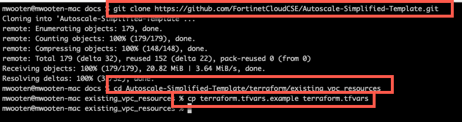
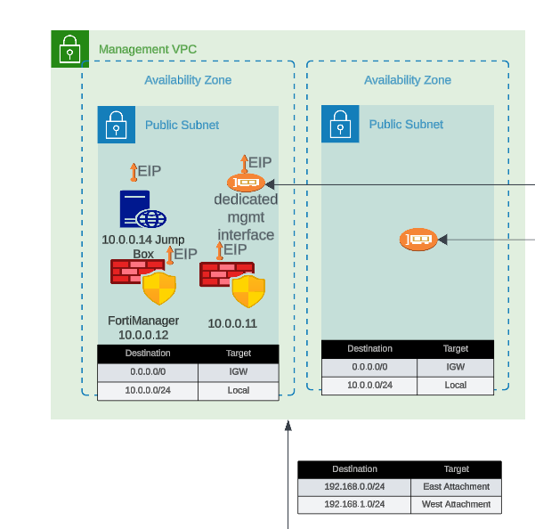
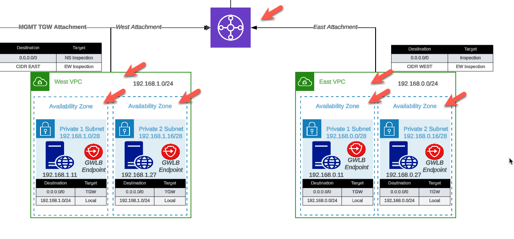
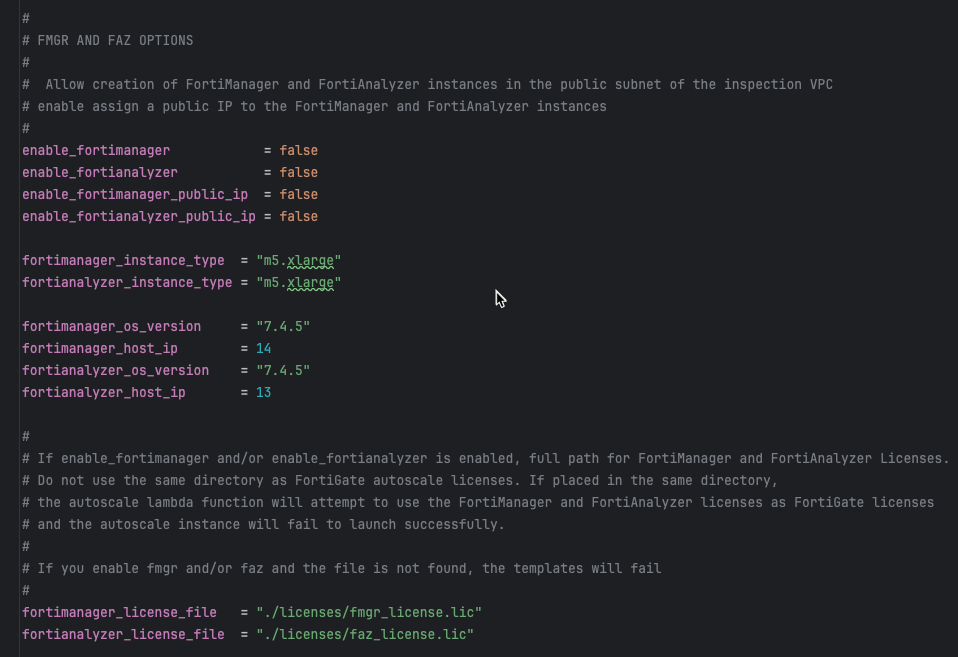
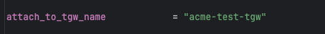
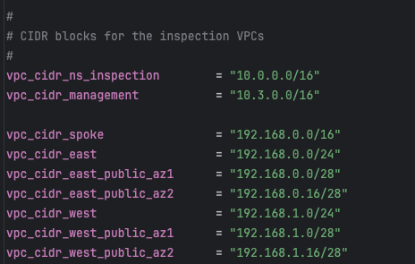
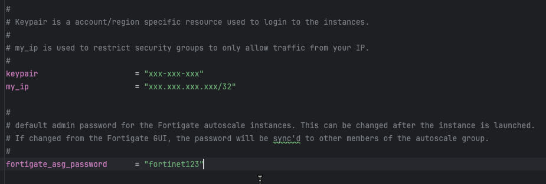
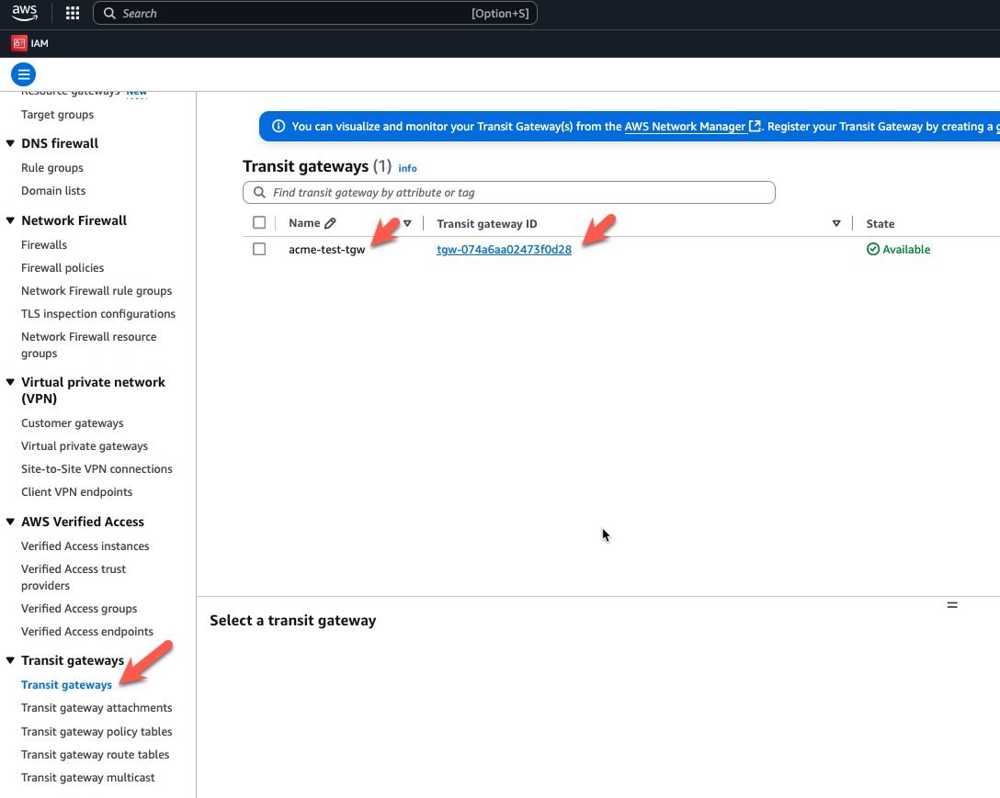

## Overview

The FortiGate Autoscale Simplified Template consists of two complementary Terraform templates that work together to deploy a complete FortiGate autoscale architecture in AWS:

1. **existing_vpc_resources** (Optional): Creates supporting infrastructure for testing, demonstration, and lab environments
2. **unified_template** (Required): Deploys the FortiGate autoscale group and inspection VPC

This modular approach allows you to:
- Deploy only the inspection VPC to integrate with existing production environments
- Create a complete lab environment including management VPC, Transit Gateway, and spoke VPCs with traffic generators
- Mix and match components based on your specific requirements

---

## Template Architecture

### Component Relationships

```
┌─────────────────────────────────────────────────────────────────┐
│ existing_vpc_resources Template (Optional)                      │
│                                                                 │
│  ┌──────────────────┐    ┌─────────────────┐                    │
│  │ Management VPC   │    │ Transit Gateway │                    │
│  │ - FortiManager   │    │ - Spoke VPCs    │                    │
│  │ - FortiAnalyzer  │    │ - Linux Instances                    │
│  │ - Jump Box       │    │ - Test Traffic  │                    │
│  └──────────────────┘    └─────────────────┘                    │
│          │                       │                              │
│          └───────────┬───────────┘                              │
│                      │                                          │
└──────────────────────┼──────────────────────────────────────────┘
                       │ (Connects via TGW)
┌──────────────────────┼──────────────────────────────────────────┐
│ unified_template (Required)     │                               │
│                      │                                          │
│  ┌────────────────── ▼ ────────────────┐                        │
│  │ Inspection VPC                      │                        │
│  │ - FortiGate Autoscale Group         │                        │
│  │ - Gateway Load Balancer             │                        │
│  │ - GWLB Endpoints                    │                        │
│  │ - Lambda Functions                  │                        │
│  └─────────────────────────────────────┘                        │
│                                                                 │
└─────────────────────────────────────────────────────────────────┘
```

---

## existing_vpc_resources Template (Optional)

### Purpose

The `existing_vpc_resources` template is designed for **testing, demonstration, and lab environments**. It creates supporting infrastructure that allows you to validate the FortiGate autoscale deployment without requiring existing production resources.

**This template is completely optional**. If you have existing VPCs, Transit Gateway, and workloads, you can skip this template entirely and deploy only the `unified_template`.

### What It Creates


The template conditionally creates the following components based on boolean variables:

#### 1. Management VPC (Optional)

**Purpose**: Centralized management infrastructure isolated from production traffic

**Components**:
- Dedicated VPC with public and private subnets across two Availability Zones
- Internet Gateway for external connectivity
- Security groups for management traffic
- Standardized resource tags for discovery by `unified_template`

**Optional Resources within Management VPC**:
- **FortiManager**: Centralized policy management and device orchestration
- **FortiAnalyzer**: Centralized logging, reporting, and analytics
- **Jump Box**: Bastion host for secure access to management and spoke resources
- **Transit Gateway Attachment**: Connectivity to spoke VPCs for management access

**When to enable**:
- Testing FortiManager/FortiAnalyzer integration
- Lab environments requiring centralized management
- Demonstrations of complete Fortinet security fabric

**When to skip**:
- Existing management infrastructure available
- Production deployments with established management plane
- Cost-sensitive testing where management features aren't required

#### 2. Transit Gateway and Spoke VPCs (Optional)

**Purpose**: Simulates production multi-VPC environment for traffic generation and testing

**Components**:
- **Transit Gateway**: Central hub for VPC interconnectivity
- **East Spoke VPC**: Simulated workload VPC with Linux instances
- **West Spoke VPC**: Simulated workload VPC with Linux instances
- **Linux Instances**: HTTP servers and traffic generators
- **TGW Route Tables**: Configurable routing for inspection and bypass scenarios

**Traffic Generation Capabilities**:
- Linux instances run HTTP servers for connectivity testing
- Instances can generate internet egress traffic
- East-West traffic between spoke VPCs for inspection testing

**Optional Debug Path**:
The template can create a **bypass attachment** from the Management VPC directly to the Transit Gateway, allowing traffic to flow:
```
Jump Box → TGW → Spoke VPC Linux Instances (bypassing FortiGate inspection)
```

**Debug path use cases**:
- Validate spoke VPC connectivity independent of FortiGate inspection
- Compare latency/throughput with and without inspection
- Troubleshoot routing issues by eliminating FortiGate as variable
- Generate baseline traffic patterns for capacity planning

**When to enable**:
- Testing autoscale behavior under load
- Demonstrating centralized egress architecture
- Validating east-west inspection policies
- Lab environments for training and enablement

**When to skip**:
- Existing spoke VPCs and Transit Gateway available
- Production deployments connecting to established workloads
- Testing only distributed inspection patterns (no TGW required)

### Configuration Variables

The template uses boolean flags to conditionally create components:

```hcl
# Management VPC Components
enable_build_management_vpc    = true    # Creates management VPC
enable_fortimanager            = true    # Deploys FortiManager in management VPC
enable_fortianalyzer           = true    # Deploys FortiAnalyzer in management VPC
enable_jump_box                = true    # Deploys jump box in management VPC
enable_mgmt_vpc_tgw_attachment = true    # Attaches management VPC to TGW

# Spoke VPC Components
enable_build_existing_subnets  = true    # Creates Transit Gateway and spoke VPCs
enable_east_linux_instances    = true    # Deploys Linux instances in east spoke VPC
enable_west_linux_instances    = true    # Deploys Linux instances in west spoke VPC
enable_debug_tgw_attachment    = true    # Creates bypass path for troubleshooting
```

### Deployment Scenarios

#### Scenario 1: Complete Lab Environment
**Use case**: Full-featured lab for testing all capabilities

```hcl
enable_build_management_vpc    = true
enable_fortimanager            = true
enable_fortianalyzer           = true
enable_jump_box                = true
enable_mgmt_vpc_tgw_attachment = true
enable_build_existing_subnets  = true
enable_east_linux_instances    = true
enable_west_linux_instances    = true
enable_debug_tgw_attachment    = true
```

**What you get**: Complete environment with management, spoke VPCs, traffic generators, and debug path

#### Scenario 2: Management VPC Only
**Use case**: Testing FortiManager/FortiAnalyzer integration without spoke VPCs

```hcl
enable_build_management_vpc    = true
enable_fortimanager            = true
enable_fortianalyzer           = true
enable_jump_box                = false
enable_mgmt_vpc_tgw_attachment = false
enable_build_existing_subnets  = false
```

**What you get**: Management VPC with FortiManager and FortiAnalyzer only

#### Scenario 3: Traffic Generation Only
**Use case**: Testing autoscale with traffic generators, no management VPC

```hcl
enable_build_management_vpc    = false
enable_build_existing_subnets  = true
enable_east_linux_instances    = true
enable_west_linux_instances    = true
enable_debug_tgw_attachment    = false
```

**What you get**: Transit Gateway and spoke VPCs with Linux instances for testing

#### Scenario 4: Production Integration
**Use case**: Deploying to existing production environment

```hcl
# Skip existing_vpc_resources entirely
# Deploy only unified_template pointing to existing TGW
```

**What you get**: Inspection VPC integrates with existing Transit Gateway and workloads

### Step-by-Step Deployment

#### Prerequisites
- AWS account with appropriate permissions
- Terraform 1.0 or later installed
- AWS CLI configured with credentials
- Git installed

#### Step 1: Clone the Repository

Clone the repository containing both templates:

```bash
git clone https://github.com/FortinetCloudCSE/Autoscale-Simplified-Template.git
cd Autoscale-Simplified-Template/terraform/existing_vpc_resources
```



#### Step 2: Create terraform.tfvars

Copy the example file and customize:

```bash
cp terraform.tfvars.example terraform.tfvars
```

#### Step 3: Configure Core Variables

**Region and Availability Zones**:


```hcl
aws_region         = "us-west-2"
availability_zone_1 = "a"
availability_zone_2 = "c"
```

**Customer Prefix and Environment**:


These values are prepended to all resources for identification:

```hcl
cp  = "acme"    # Customer prefix
env = "test"    # Environment: prod, test, dev
```

**Result**: Resources named like `acme-test-management-vpc`, `acme-test-tgw`, etc.


**Important**: These `cp` and `env` values **must match** between `existing_vpc_resources` and `unified_template` for proper resource discovery via tags.

#### Step 4: Configure Component Flags

**Management VPC**:



```hcl
enable_build_management_vpc = true
```

**Spoke VPCs and Transit Gateway**:



```hcl
enable_build_existing_subnets = true
```

#### Step 5: Configure Optional Components

**FortiManager and FortiAnalyzer**:



```hcl
enable_fortimanager  = true
fortimanager_instance_type = "m5.large"
fortimanager_os_version = "7.4.5"
fortimanager_host_ip = "10"  # .3.0.10 within management VPC CIDR

enable_fortianalyzer = true
fortianalyzer_instance_type = "m5.large"
fortianalyzer_os_version = "7.4.5"
fortianalyzer_host_ip = "11"  # .3.0.11 within management VPC CIDR
```

**Management VPC Transit Gateway Attachment**:



```hcl
enable_mgmt_vpc_tgw_attachment = true
```

This allows jump box and management instances to reach spoke VPC Linux instances for testing.

**Linux Traffic Generators**:


```hcl
enable_jump_box = true
jump_box_instance_type = "t3.micro"

enable_east_linux_instances = true
east_linux_instance_type = "t3.micro"

enable_west_linux_instances = true
west_linux_instance_type = "t3.micro"
```

#### Step 6: Configure Network CIDRs



```hcl
vpc_cidr_management = "10.3.0.0/16"
vpc_cidr_east       = "192.168.0.0/24"
vpc_cidr_west       = "192.168.1.0/24"
vpc_cidr_spoke      = "192.168.0.0/16"  # Supernet for all spoke VPCs
```

Ensure CIDRs don't overlap with existing networks.

#### Step 7: Configure Security Variables

```hcl
keypair = "my-aws-keypair"  # Must exist in target region
my_ip   = "203.0.113.10/32" # Your public IP for SSH access
```

#### Step 8: Deploy the Template

Initialize Terraform:
```bash
terraform init
```

Review the execution plan:
```bash
terraform plan
```

Deploy the infrastructure:
```bash
terraform apply
```

Type `yes` when prompted to confirm.

**Expected deployment time**: 10-15 minutes

#### Step 9: Verify Deployment

After successful deployment, verify:

1. **Management VPC created** (if enabled):
   ```bash
   aws ec2 describe-vpcs --filters "Name=tag:Name,Values=acme-test-management-vpc"
   ```

2. **FortiManager accessible** (if enabled):
   - Navigate to EC2 console
   - Find FortiManager instance
   - Connect via public IP: `https://<FortiManager-IP>`
   - Default credentials: `admin` / instance-id

3. **Transit Gateway created** (if enabled):
   ```bash
   aws ec2 describe-transit-gateways --filters "Name=tag:Name,Values=acme-test-tgw"
   ```

4. **Spoke VPCs and Linux instances** (if enabled):
   - Find Linux instance public IPs in EC2 console
   - Test HTTP connectivity: `curl http://<linux-instance-ip>`

### Outputs

The template provides outputs for use by the `unified_template`:

```bash
terraform output
```

Important outputs:
- `management_vpc_id`: ID of created management VPC
- `tgw_id`: ID of created Transit Gateway
- `tgw_name`: Name tag of Transit Gateway
- `fortimanager_private_ip`: Private IP of FortiManager (if created)
- `fortianalyzer_private_ip`: Private IP of FortiAnalyzer (if created)
- `east_linux_instance_ips`: IPs of east spoke instances
- `west_linux_instance_ips`: IPs of west spoke instances

### Important Notes

{}
**Resource Lifecycle Considerations**

If you deploy the `existing_vpc_resources` template:
- Management VPC and resources (FortiManager, FortiAnalyzer) will be destroyed when you run `terraform destroy`
- If you want management resources to persist across inspection VPC redeployments, consider:
  - Deploying management VPC separately with different Terraform state
  - Using existing management infrastructure instead of template-created resources
  - Setting appropriate lifecycle rules in Terraform to prevent destruction
{}

{}
**Cost Optimization Tips**

The `existing_vpc_resources` template can create expensive resources:
- FortiManager m5.large: ~$0.10/hour (~$73/month)
- FortiAnalyzer m5.large: ~$0.10/hour (~$73/month)
- Transit Gateway: $0.05/hour (~$36/month) + data processing charges
- NAT Gateways: $0.045/hour each (~$33/month each)

For cost-sensitive testing:
- Use smaller instance types (t3.micro, t3.small)
- Disable FortiManager/FortiAnalyzer if not testing those features
- Destroy resources when not actively testing
- Use AWS Cost Explorer to monitor spend
{}

---

## unified_template (Required)

### Purpose

The `unified_template` deploys the core FortiGate autoscale infrastructure, including:
- Inspection VPC with multi-AZ subnets
- FortiGate autoscale groups (BYOL and/or on-demand)
- Gateway Load Balancer and endpoints
- Lambda functions for lifecycle management
- Optional Transit Gateway attachment

This template is **required** for all deployments and can operate independently or integrate with resources created by `existing_vpc_resources`.

### Integration Patterns

#### Pattern 1: Full Lab Environment (with existing_vpc_resources)

**Scenario**: Complete testing environment with management and traffic generation

**Steps**:
1. Deploy `existing_vpc_resources` with desired components
2. Configure `unified_template` to connect to created TGW:
   ```hcl
   enable_tgw_attachment = true
   attach_to_tgw_name    = "acme-test-tgw"  # Matches existing_vpc_resources output
   ```
3. Use same `cp` and `env` values for resource discovery

**Result**: Inspection VPC connects to existing management VPC and spoke VPCs via TGW

#### Pattern 2: Production Integration (existing infrastructure)

**Scenario**: Deploy FortiGate inspection to existing production Transit Gateway

**Steps**:
1. Skip `existing_vpc_resources` entirely
2. Configure `unified_template` to connect to production TGW:
   ```hcl
   enable_tgw_attachment = true
   attach_to_tgw_name    = "production-tgw"  # Your existing TGW name
   ```
3. Verify TGW route tables route traffic to inspection VPC

**Result**: FortiGate autoscale group integrates with existing production workloads

#### Pattern 3: Distributed Inspection (no TGW)

**Scenario**: Distributed architecture where spoke VPCs have their own internet gateways

**Steps**:
1. Skip `existing_vpc_resources`
2. Configure `unified_template` without TGW attachment:
   ```hcl
   enable_tgw_attachment = false
   ```
3. Deploy GWLB endpoints in spoke VPCs (separate process)

**Result**: Bump-in-the-wire inspection; spoke VPCs handle their own internet egress

### Step-by-Step Deployment

#### Prerequisites
- `existing_vpc_resources` deployed (if using lab environment)
- AWS account with permissions
- Terraform 1.0 or later
- FortiGate licenses (if using BYOL)

#### Step 1: Navigate to Template Directory

```bash
cd Autoscale-Simplified-Template/terraform/unified_template
```

#### Step 2: Create terraform.tfvars

```bash
cp terraform.tfvars.example terraform.tfvars
```

#### Step 3: Configure Core Variables

**Region and Availability Zones** (must match `existing_vpc_resources`):


```hcl
aws_region         = "us-west-2"
availability_zone_1 = "a"
availability_zone_2 = "c"
```

**Customer Prefix and Environment** (must match `existing_vpc_resources`):


```hcl
cp  = "acme"
env = "test"
```

#### Step 4: Configure Security Variables



```hcl
keypair                 = "my-aws-keypair"
my_ip                   = "203.0.113.10/32"
fortigate_asg_password  = "SecurePassword123!"  # Admin password for FortiGates
```

#### Step 5: Configure Transit Gateway Integration


**To connect to Transit Gateway**:

```hcl
enable_tgw_attachment = true
```



**Specify TGW name**:

```hcl
attach_to_tgw_name = "acme-test-tgw"  # Name of existing TGW
```

**For production integration**:
```hcl
attach_to_tgw_name = "production-tgw"  # Your existing production TGW
```

{}
**Finding Your Transit Gateway Name**

If you don't know your TGW name:
```bash
aws ec2 describe-transit-gateways --query 'TransitGateways[*].[Tags[?Key==`Name`].Value | [0], TransitGatewayId]' --output table
```

The `attach_to_tgw_name` should match the `Name` tag of your Transit Gateway.
{}

**To skip TGW attachment** (distributed architecture):

```hcl
enable_tgw_attachment = false
```

#### Step 6: Configure Architecture Options

**Firewall Mode**:
```hcl
firewall_policy_mode = "1-arm"  # or "2-arm"
```

**Internet Egress**:
```hcl
access_internet_mode = "nat_gw"  # or "eip"
```

**Management Options**:
```hcl
enable_dedicated_management_eni = true
enable_dedicated_management_vpc = false  # Use management VPC from existing_vpc_resources

# If using existing_vpc_resources with default tags:
dedicated_management_vpc_tag = "acme-test-management-vpc"
dedicated_management_public_az1_subnet_tag = "acme-test-management-public-az1-subnet"
dedicated_management_public_az2_subnet_tag = "acme-test-management-public-az2-subnet"
```

**East-West Inspection**:
```hcl
enable_east_west_inspection = true  # Route spoke-to-spoke traffic through FortiGate
```

#### Step 7: Configure Licensing


**Option 1: BYOL Licensing**
```hcl
asg_license_directory = "asg_license"  # Directory containing .lic files
```

Place license files in `./asg_license/` directory before deploying.

**Option 2: FortiFlex Licensing**
```hcl
fortiflex_username      = "your-api-username-uuid"
fortiflex_password      = "your-api-password"
fortiflex_sn_list       = ["FGVMELTM12345678"]  # Optional
fortiflex_configid_list = ["My_4CPU_Config"]
```

**Option 3: PAYG (AWS Marketplace)**
```hcl
# No configuration needed - set ASG capacities to use on-demand
asg_byol_asg_min_size = 0
asg_byol_asg_max_size = 0

asg_ondemand_asg_min_size = 2
asg_ondemand_asg_max_size = 8
```

See [Licensing](../3_licensing/) section for detailed guidance.

#### Step 8: Configure Autoscale Group Capacity

```hcl
# BYOL ASG
asg_byol_asg_min_size     = 1
asg_byol_asg_max_size     = 2
asg_byol_asg_desired_size = 1

# On-Demand ASG
asg_ondemand_asg_min_size     = 0
asg_ondemand_asg_max_size     = 2
asg_ondemand_asg_desired_size = 0
```

#### Step 9: Configure FortiGate Specifications

```hcl
fgt_instance_type = "c7gn.xlarge"
fortios_version   = "7.4.5"
fortigate_gui_port = 443
```

#### Step 10: Configure FortiManager Integration (Optional)

```hcl
enable_fortimanager_integration = true
fortimanager_ip                 = "10.3.0.10"  # FortiManager private IP
fortimanager_sn                 = "FMGVM0000000001"
fortimanager_vrf_select         = 1
```

{}
**FortiManager 7.6.3+ Configuration Required**

If using FortiManager 7.6.3 or later, you **must** enable VM device recognition before deploying:

```
config system global
    set fgfm-allow-vm enable
end
```

See [FortiManager Integration](../4_solution_components/#fortimanager-integration) for details.
{}

#### Step 11: Configure Network CIDRs

```hcl
vpc_cidr_inspection = "10.0.0.0/16"
vpc_cidr_management = "10.3.0.0/16"  # Must match existing_vpc_resources if used
vpc_cidr_spoke      = "192.168.0.0/16"  # Supernet
vpc_cidr_east       = "192.168.0.0/24"
vpc_cidr_west       = "192.168.1.0/24"

subnet_bits = 8  # /16 + 8 = /24 subnets
```

#### Step 12: Configure GWLB Endpoint Names

```hcl
endpoint_name_az1 = "asg-gwlbe_az1"
endpoint_name_az2 = "asg-gwlbe_az2"
```

These names are used for route table lookups.

#### Step 13: Deploy the Template

Initialize Terraform:
```bash
terraform init
```

Review the execution plan:
```bash
terraform plan
```

Deploy the infrastructure:
```bash
terraform apply
```

Type `yes` when prompted.

**Expected deployment time**: 15-20 minutes

#### Step 14: Verify Deployment

**Check FortiGate instances**:
```bash
aws autoscaling describe-auto-scaling-groups --query 'AutoScalingGroups[*].[AutoScalingGroupName,DesiredCapacity,Instances[*].InstanceId]'
```

**Access FortiGate GUI**:
1. Find FortiGate instance public IP in EC2 console
2. Navigate to `https://<fortigate-ip>:<gui-port>`
3. Login with `admin` / configured password

**Verify Transit Gateway attachment** (if enabled):
```bash
aws ec2 describe-transit-gateway-attachments --filters "Name=state,Values=available"
```

**Test traffic flow**:
- From jump box (if using existing_vpc_resources), test connectivity to spoke VPC Linux instances
- Verify traffic logs appear in FortiGate
- Check CloudWatch metrics for autoscale group health

### Outputs

Important outputs from the template:

```bash
terraform output
```

- `inspection_vpc_id`: ID of inspection VPC
- `gwlb_endpoint_az1_id`: GWLB endpoint ID in AZ1
- `gwlb_endpoint_az2_id`: GWLB endpoint ID in AZ2
- `fortigate_autoscale_group_name`: Name of BYOL ASG
- `lambda_function_name`: Name of lifecycle management Lambda function

---

## Complete Deployment Workflows

### Workflow 1: Lab Environment from Scratch

**Objective**: Create complete testing environment with management and spoke VPCs

```bash
# Step 1: Deploy existing_vpc_resources
cd Autoscale-Simplified-Template/terraform/existing_vpc_resources
cp terraform.tfvars.example terraform.tfvars
# Edit terraform.tfvars with lab configuration
terraform init
terraform apply

# Step 2: Deploy unified_template
cd ../unified_template
cp terraform.tfvars.example terraform.tfvars
# Edit terraform.tfvars to connect to created TGW
# Use same cp and env values
terraform init
terraform apply

# Step 3: Verify connectivity
ssh -i ~/.ssh/my-keypair.pem ec2-user@<jump-box-ip>
# From jump box, test spoke VPC instances
curl http://<east-linux-ip>
curl http://<west-linux-ip>
```

### Workflow 2: Production Integration

**Objective**: Deploy inspection VPC to existing production Transit Gateway

```bash
# Step 1: Skip existing_vpc_resources entirely

# Step 2: Deploy unified_template
cd Autoscale-Simplified-Template/terraform/unified_template
cp terraform.tfvars.example terraform.tfvars
# Edit terraform.tfvars:
# - Set attach_to_tgw_name to existing production TGW
# - Configure production-appropriate capacity
# - Use BYOL or FortiFlex for cost optimization
terraform init
terraform apply

# Step 3: Update TGW route tables
# Route spoke VPC traffic to inspection VPC
# via AWS Console or CLI
```

### Workflow 3: Distributed Inspection (No TGW)

**Objective**: Deploy FortiGate inspection without Transit Gateway

```bash
# Step 1: Skip existing_vpc_resources

# Step 2: Deploy unified_template
cd Autoscale-Simplified-Template/terraform/unified_template
cp terraform.tfvars.example terraform.tfvars
# Edit terraform.tfvars:
# - Set enable_tgw_attachment = false
# - Configure firewall_policy_mode = "1-arm" (recommended)
terraform init
terraform apply

# Step 3: Deploy GWLB endpoints in spoke VPCs
# (Separate Terraform or CloudFormation process)
```

---

## Troubleshooting

### Common Issues

#### Issue 1: TGW attachment fails

**Symptoms**:
```
Error: error creating EC2 Transit Gateway VPC Attachment: InvalidTransitGatewayID.NotFound
```

**Solutions**:
- Verify `attach_to_tgw_name` matches existing Transit Gateway name exactly
- Check TGW is in "available" state
- Ensure TGW is in same AWS region as deployment
- Verify TGW name tag exists: `aws ec2 describe-transit-gateways`

#### Issue 2: Management VPC discovery fails

**Symptoms**:
```
Error: No VPC found matching tags
```

**Solutions**:
- Verify `cp` and `env` values match between templates
- Check management VPC was created successfully
- Verify resource tags using AWS Console
- Ensure `dedicated_management_vpc_tag` matches actual VPC name tag

#### Issue 3: License assignment failures

**Symptoms**: FortiGate instances launch but remain unlicensed

**Solutions**:
- Check Lambda CloudWatch logs for errors
- Verify license files exist in specified directory
- For FortiFlex: Check API credentials and point balance
- Ensure sufficient licenses for `asg_max_size`

#### Issue 4: Instances fail health checks

**Symptoms**: Instances repeatedly terminate and relaunch

**Solutions**:
- Check security groups allow health check traffic
- Verify FortiGate instances can reach FortiGuard servers
- Review FortiGate logs via SSH: `diagnose debug application fgfmd -1`
- Increase health check grace period in ASG settings

---

## Cleanup

### Destroying Resources

**Order matters** when destroying resources:

```bash
# Step 1: Destroy unified_template first
cd Autoscale-Simplified-Template/terraform/unified_template
terraform destroy

# Step 2: Destroy existing_vpc_resources
cd ../existing_vpc_resources
terraform destroy
```

{}
**Dependency Considerations**

If you destroy `existing_vpc_resources` before `unified_template`:
- Transit Gateway attachment deletion will fail
- You'll need to manually delete the attachment or destroy in correct order

Always destroy dependent resources (inspection VPC) before foundation resources (management VPC, TGW).
{}

### Selective Resource Cleanup

To destroy only specific components:

```bash
# Destroy only autoscale group
terraform destroy -target=module.fortigate_autoscale

# Destroy only management VPC components
terraform destroy -target=module.management_vpc
```

---

## Best Practices

### Development and Testing

1. **Start small**: Deploy with `min_size = 1`, `max_size = 2` for initial validation
2. **Use jump box**: Deploy jump box in management VPC for easier troubleshooting
3. **Enable debug TGW attachment**: Allows testing without FortiGate in path
4. **Monitor costs**: Use AWS Cost Explorer to track spending during testing

### Production Deployments

1. **Skip existing_vpc_resources**: Use existing production infrastructure
2. **Right-size capacity**: Set `min_size` to baseline, `max_size` to peak + 20%
3. **Use BYOL or FortiFlex**: Optimize costs for long-term deployments
4. **Enable FortiManager**: Centralized management for production operations
5. **Separate state files**: Use different Terraform workspaces or state backends
6. **Implement backup strategy**: Backup FortiManager/FortiAnalyzer configurations

### Ongoing Operations

1. **Monitor autoscale events**: Set up CloudWatch alarms for scale-out/scale-in
2. **Review Lambda logs**: Regularly check for license assignment issues
3. **Update gradually**: Test FortiOS updates in dev before production
4. **Document customizations**: Maintain runbook of configuration changes
5. **Regular testing**: Periodically validate failover and scaling behavior

---

## Additional Resources

### Documentation
- [Solution Components](../4_solution_components/): Detailed component explanations
- [Licensing](../3_licensing/): Comprehensive licensing guide
- [Overview](../2_overview/): Architecture patterns and benefits

### Terraform Modules
- **GitHub Repository**: [Autoscale-Simplified-Template](https://github.com/FortinetCloudCSE/Autoscale-Simplified-Template)
- **Enterprise Templates**: [terraform-aws-cloud-modules](https://github.com/fortinetdev/terraform-aws-cloud-modules)

### Fortinet Resources
- **FortiGate AWS Guide**: [docs.fortinet.com](https://docs.fortinet.com/document/fortigate-public-cloud/)
- **Fortinet Developer Network**: [fndn.fortinet.net](https://fndn.fortinet.net)

---

## Summary

The FortiGate Autoscale Simplified Template provides flexible deployment options:

- **existing_vpc_resources**: Optional template for creating lab/test infrastructure
- **unified_template**: Required template for FortiGate autoscale deployment

Choose your deployment pattern:
- **Lab/Testing**: Deploy both templates for complete environment
- **Production**: Deploy only unified_template to existing infrastructure
- **Distributed**: Deploy unified_template without TGW attachment

Both templates work independently or together, providing the flexibility to match your specific requirements—from development and testing to production deployments.
