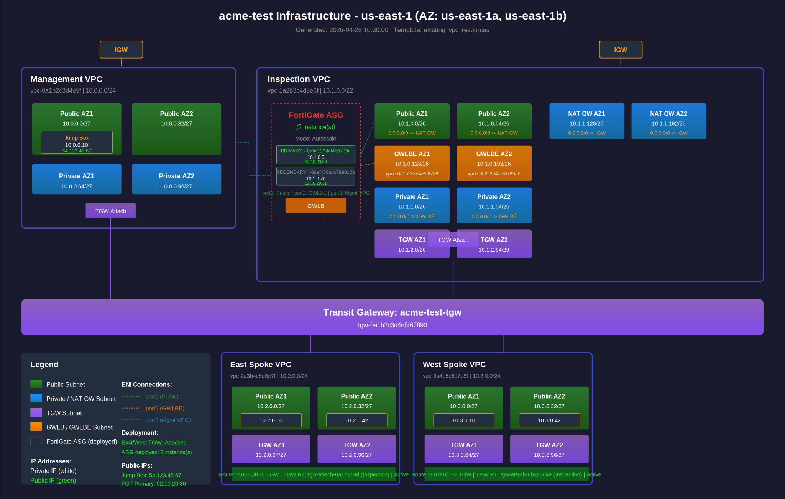

# generate_network_diagram.sh

**Repository:** [FortinetCloudCSE/fortinet-ui-terraform](https://github.com/FortinetCloudCSE/fortinet-ui-terraform)

**Full path:** `terraform/aws/existing_vpc_resources/verify_scripts/generate_network_diagram.sh`

---

## Overview

Generates two output files reflecting the current state of a deployed `existing_vpc_resources` infrastructure stack:

- `logs/network_diagram.svg` — SVG network topology diagram
- `logs/network_diagram.md` — Markdown documentation with resource tables and routing status

Both files are written to the `logs/` directory at the repository root. The `logs/` directory is in `.gitignore` because output is deployment-specific.

---

## Usage

```bash
# From the existing_vpc_resources terraform directory:
cd terraform/aws/existing_vpc_resources

# Full generation (SVG + markdown)
./verify_scripts/generate_network_diagram.sh

# Quick update — re-query only FortiGate instance IPs in an existing .md file
./verify_scripts/generate_network_diagram.sh --fortigates-only

# Called automatically at the end of the full verification run:
./verify_scripts/verify_all.sh --verify all
```

---

## How It Works

### Step 1 — Read static config from `terraform.tfvars`

The script reads `terraform/aws/existing_vpc_resources/terraform.tfvars` directly using the `get_tfvar` helper from `common_functions.sh`. This provides:

| Variable | Used for |
|----------|----------|
| `aws_region`, `availability_zone_1/2` | Diagram title, all AWS API calls |
| `cp`, `env` | Builds the `{cp}-{env}` naming prefix for all resource tag lookups |
| `vpc_cidr_management/inspection/east/west` | VPC CIDR labels in the diagram |
| `enable_autoscale_deployment`, `enable_ha_pair_deployment` | Determines "Mode" label in FortiGate ASG box |
| `enable_distributed_egress_vpcs`, `distributed_egress_vpc_count` | Controls whether Distributed VPC section is rendered |
| `enable_fortitester_1/2` | Controls whether FortiTester section is rendered |

It also optionally reads `terraform/aws/autoscale_template/terraform.tfvars` (if it exists) for FortiManager integration settings.

### Step 2 — Query live AWS resources by tag name

All dynamic data (IDs, CIDRs, IPs) is fetched at runtime using `aws ec2 describe-*` calls. Resources are found by their `Name` tag, which always follows the `{cp}-{env}-{resource}` naming convention.

**VPC IDs** — looked up by `Name` tag:
```
{prefix}-management-vpc
{prefix}-inspection-vpc
{prefix}-east-vpc
{prefix}-west-vpc
```

**Subnet CIDRs** — one `describe-subnets` call per subnet:
```
{prefix}-management-public-az1-subnet
{prefix}-inspection-gwlbe-az1-subnet
... (all subnets in all VPCs)
```

**Instance IPs** — private and public, by instance `Name` tag:
```
{prefix}-management-jump-box-instance
{prefix}-east-public-az1-instance
{prefix}-distributed-1-instance-az1
{prefix}-fortitester-1
```

**FortiGate ASG instances** — three separate queries to handle naming variations from the upstream autoscale module (which may truncate the prefix):
1. `Name=*fortigate*` tag filter
2. `Name=*fgt*asg*` tag filter
3. All running instances in the inspection VPC with `Name=*fgt*`

Each FortiGate query also fetches the `Autoscale Role` tag (Primary/Secondary) and scans all ENIs for a public IP (management ENI may not be the primary ENI).

**FortiTester ENIs** — fetches all network interfaces attached to the FortiTester instance to extract port2 and port3 IPs by device index.

**TGW route table status** — queries east and west TGW route tables for a static `0.0.0.0/0` route to determine whether the autoscale template has been deployed and traffic is flowing through the FortiGates.

**GWLB endpoints** — checks for deployed `vpce-*` endpoints by the `gwlbe_az1/az2` name pattern.

### Step 3 — Write SVG and Markdown

The SVG is written as a single bash heredoc with shell variable substitution — no templating engine. Layout is fixed at `2200 x 1400` with hardcoded coordinates for each VPC block. Conditional sections (Distributed VPCs, FortiTesters) are appended only when their feature flags are enabled and instances are found.

The Markdown file includes:
- Resource summary tables (VPCs, TGW, instances with public IPs)
- FortiGate ASG instance table (name, ID, role, private IP, public management IP)
- FortiManager integration details (if enabled)
- FortiTester multi-port details (if deployed)
- Routing status table for all default routes
- Next steps if autoscale template has not yet been deployed

### `--fortigates-only` mode

Skips all AWS queries except the three FortiGate instance lookups. Uses `awk` to surgically replace the `### FortiGate AutoScale Group Instances` section in an existing `.md` file without regenerating the full diagram. Useful after a scale-in/scale-out event.

---

## Layout Reference

```
+-------------------+  +------------------------------------------+
|  Management VPC   |  |           Inspection VPC                 |
|  [Jump Box]       |  | [FortiGate ASG] [Public] [GWLBE] [NATgw] |
|                   |  |                 [TGW attach]             |
+-------------------+  +------------------------------------------+
            |                         |
        +---+-------------------------+---+
        |         Transit Gateway         |
        +---+-------------------------+---+
            |                         |
  +-----------------+       +-----------------+
  |  East Spoke VPC |       |  West Spoke VPC |
  |  [Public AZ1/2] |       |  [Public AZ1/2] |
  |  [TGW AZ1/2]   |       |  [TGW AZ1/2]   |
  +-----------------+       +-----------------+

  +-----------------+    (only if enable_distributed_egress_vpcs=true)
  |  Distributed    |
  |  VPC 1          |
  +-----------------+
```

**Color coding:**

| Color | Subnet type |
|-------|-------------|
| Green | Public |
| Blue | Private / NAT GW |
| Purple | TGW |
| Orange | GWLB / GWLBE |
| Red dashed | FortiGate ASG boundary |
| Bright green text | Public IP |
| White text | Private IP |

---

## Example Output

The diagram below was generated with example data (`acme-test`, `us-east-1`, with 2 FortiGate instances deployed):



---

## Dependencies

- `aws` CLI — must be authenticated and have read permissions for EC2 resources
- `jq` — used to parse JSON output from FortiGate instance queries
- `common_functions.sh` — provides `get_tfvar`, `print_info`, `print_pass`, `print_fail`, `print_section`
- `terraform.tfvars` — must exist in `terraform/aws/existing_vpc_resources/`
